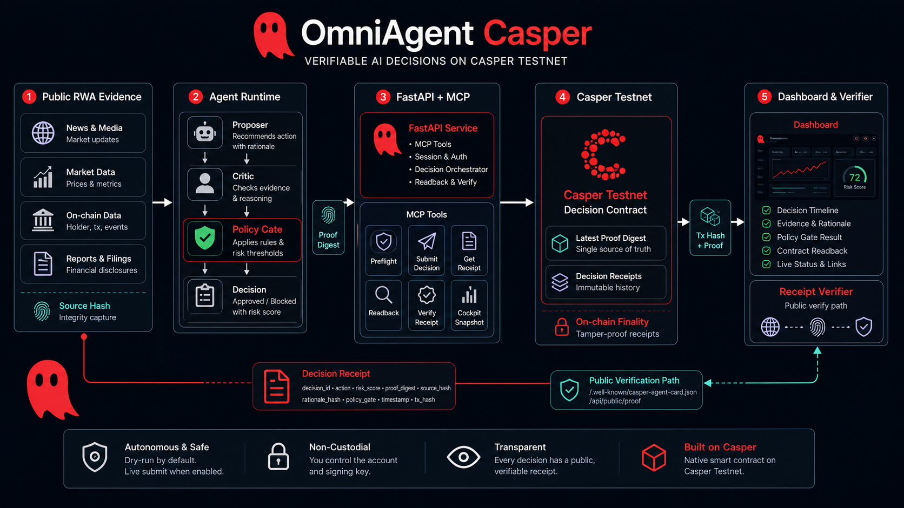

<p align="center">
  <a href="https://dorahacks.io/hackathon/casper-agentic-buildathon/detail">
    
  </a>
</p>

<p align="center">
  <a href="frontend/public/imgs/omniagent-mascot.png"></a>
  <a href="https://dorahacks.io/hackathon/casper-agentic-buildathon/detail"></a>
  <a href="contracts/casper-decision-proof"></a>
  <a href="https://testnet.cspr.live/contract/5a82529f9ba05e716933384ddc9862710ba9a0fd3a7347ab1e8c6e60b1a4c861"></a>
</p>

# OmniAgent Casper

OmniAgent Casper is a verifiable AI agent for **RWA collateral risk decisions**
on Casper Testnet. It answers a practical financing question:

> Should this tokenized collateral remain financeable after fresh public market
> evidence changes its risk profile?

The project exists because DeFi credit and RWA financing workflows need more
than an AI recommendation. They need a replayable trail: source evidence,
agent reasoning, deterministic policy gates, a Casper transaction, contract
readback, and a public verifier that does not require private keys or internal
operator access.

OmniAgent reads public RWA evidence, runs a proposer/critic/policy-gate agent
loop, writes a decision receipt to a native Casper Rust contract, optionally
enforces collateral state via a vault (`freeze` / `unfreeze` / `set_ltv`), and
exposes everything through a dashboard, public proof endpoint, and verifier
script. It is built as a Casper-only demo for the
[Casper Agentic Buildathon Finals](https://dorahacks.io/hackathon/casper-agentic-buildathon-finals/detail).

## Judge path (≈5 minutes)

1. Open [https://omniyield.app](https://omniyield.app) — flight deck + latest proof
2. Open [https://omniyield.app/api/public/proof](https://omniyield.app/api/public/proof) — public-safe JSON (no keys)
3. Open the latest decision deploy from the proof payload / table below
4. Hit [https://omniyield.app/api/x402/rwa-evidence](https://omniyield.app/api/x402/rwa-evidence) unpaid → HTTP **402** on `casper:casper-test`
5. Open vault freeze / unfreeze / `set_ltv` deploys — enforcement is real state change

Full DoraHacks paste: [`docs/dorahacks-finals-description.md`](docs/dorahacks-finals-description.md)

## Current Public Deployment

Last verified: 2026-07-23.

| Surface | URL / Status |
|---------|--------------|
| Frontend proof console | [https://omniyield.app](https://omniyield.app) |
| Backend public proof | [https://omniagent-production.up.railway.app/api/public/proof](https://omniagent-production.up.railway.app/api/public/proof) |
| Agent card | [https://omniagent-production.up.railway.app/.well-known/casper-agent-card.json](https://omniagent-production.up.railway.app/.well-known/casper-agent-card.json) |
| Paywalled x402 evidence | [https://omniyield.app/api/x402/rwa-evidence](https://omniyield.app/api/x402/rwa-evidence) |
| x402 status | `verified`, `bindingStatus=bound`, WCSPR `3d80df21…`, facilitator `x402-facilitator.cspr.cloud` |
| x402 settle (row 6) | [`93074ccb…`](https://testnet.cspr.live/deploy/93074ccb7f55f7a6eac5f4acdf5de21943c43384a1bfb0f1e194c736eed3bae5) |
| Live submit | Enabled with a `2.5 CSPR` payment cap, `4` submissions/day, `10 CSPR`/day budget, and `50 CSPR` reserve |
| Autonomous loop | Armed at `1800s` interval with fail-closed guardrails |
| Latest live decision | [`87734909…`](https://testnet.cspr.live/deploy/87734909bab1a83890228b59a66c64fd7636ce99eb4beeb4ac5d9c07b990bb22) (`haircut`, 2026-07-23) |
| Vault freeze / unfreeze / set_ltv | [`36d1f699…`](https://testnet.cspr.live/deploy/36d1f699ebf201e1c2617a16ee9152a56c567351ba733e2e87b944db7c325176) / [`39dc155a…`](https://testnet.cspr.live/deploy/39dc155aac0a9be1a23aa424d60d5783d5ff75fb2cb9ab51d4a630a7ea245646) / [`43a8c497…`](https://testnet.cspr.live/deploy/43a8c497166b0d219a9867464b6de2ea66c5a6512f725f51df9bd89341612604) |

The x402 evidence paywall settles **natively on Casper Testnet** via the
CSPR.cloud facilitator (`x402-facilitator.cspr.cloud`) using CEP-18
`transfer_with_authorization` (Wrapped CSPR package `3d80df21…`). Decision
receipts, proof digests, contract readback, and the public verifier remain
anchored to Casper.



## High-Level Design

1. Public RWA evidence is normalized into a source hash and risk score.
2. The agent runtime proposes an action, critiques it, and applies a deterministic policy gate.
3. FastAPI exposes the Casper MCP tools, dashboard API, public proof API, and verifier inputs.
4. The Casper Testnet contract stores the latest proof digest and per-decision receipt.
5. The public dashboard and verifier replay the receipt path without exposing signer paths, operator tokens, or raw runtime logs; mutations require a separate authenticated API operator session.

- **Backend runtime:** `fastapi-casper-agent`
- **MCP tool family:** `casper_*`
- **On-chain component:** [contracts/casper-decision-proof](contracts/casper-decision-proof) (receipts) + [contracts/collateral-vault](contracts/collateral-vault) (enforcement)
- **Frontend:** a Casper proof cockpit for decision traces, policy gates, deploy status, readback checks, judge packet, and recovery actions

### Collateral vault (enforcement)

After a verified decision readback, the autonomous loop can map policy actions to
vault entry points (`block→freeze`, `approve→unfreeze`, `haircut→set_ltv`). Arm with:

```bash
CASPER_VAULT_CONTRACT_HASH=<hash>
CASPER_VAULT_ENFORCE_ENABLED=true
CASPER_VAULT_ASSET_ID=rwa-demo-collateral-001
```

Install helper: [`scripts/install-collateral-vault.sh`](scripts/install-collateral-vault.sh).
Canary: `cd backend && uv run python scripts/vault_demo_cycle.py`.
Public proof exposes the latest vault action under `vault` (and `contractLinks.vaultContractHash` when configured).

## Safety Model (Dry Run vs Live Submit)

Live Casper submission is **off by default** in local/source configuration.
The frontend is a read-only public proof console and does not drive recurring
execution. Operator mutations use the authenticated API/CLI path. The current
Railway live loop was armed only after a 2.5-CSPR canary confirmed with matching
contract receipt readback; persistent dedupe, count/budget caps, and the balance
reserve remain enforced on every cycle.

## Autonomous Agent Loop

The agent can continuously fetch RWA evidence without continuously spending
CSPR. It writes only a materially new decision, subject to a persistent intent
lock, an on-chain replay check, a six-hour cooldown, a daily count/budget cap,
and a protected balance reserve.

Enable the loop via environment variables:

```bash
cd backend
CASPER_AGENT_LOOP_ENABLED=true \
CASPER_AGENT_LOOP_INTERVAL_SEC=3600 \
CASPER_AGENT_LOOP_DRY_RUN=true \
uv run uvicorn app.main:app --host 127.0.0.1 --port 8000
```

- `CASPER_AGENT_LOOP_ENABLED` — starts the background asyncio loop on boot
- `CASPER_AGENT_LOOP_INTERVAL_SEC` — seconds between evidence checks (default: 3600)
- `CASPER_AGENT_LOOP_DRY_RUN` — defaults to true and writes local ledger entries only
- `CASPER_AGENT_LOOP_LIVE_SUBMIT_ENABLED` — independent arm required before a non-dry loop may submit; defaults to false

The loop fetches live US Treasury 10-Year yield from the public fiscaldata.treasury.gov API. If that API is unreachable or does not return a 10-Year observation, the loop fails closed and records the error instead of substituting static evidence. Loop status is visible in the dashboard and via `GET /api/dashboard/loop`. The dashboard keeps the latest live view and a bounded per-cycle history so judges can select one loop attempt and inspect its matching AI trace and MCP-compatible tool output together.

- Dry runs are local-only proof checks; do not use them as the recorded demo path.
- Live submission is allowed only when all runtime proof gates pass and live-submit is explicitly enabled.
- Configured live submission runs `casper-client`, probes Casper state, captures a Casper Testnet transaction hash, and records it in the dashboard proof log.
- When live submit returns a deploy hash, the loop can poll confirmation and attach readback evidence automatically.

Live mode requires:

1. A funded Casper Testnet account
2. A signer path outside git
3. Deployed decision contract hash and package hash
4. `casper-client` available on PATH or via `CASPER_CLIENT_PATH`
5. `CASPER_LIVE_SUBMIT_ENABLED=true`
6. A non-empty `API_OPERATOR_TOKEN`; in this patched version anonymous sessions are never operators (deploy it before relying on this guarantee)
7. A persistent `CASPER_DECISION_LEDGER_PATH` on a mounted volume
8. For an autonomous live loop only: `CASPER_AGENT_LOOP_LIVE_SUBMIT_ENABLED=true`; source defaults require 21600 seconds, while the current guarded Railway deployment explicitly overrides the interval and cooldown to 1800 seconds
9. The explicit live-submit command flag when running the one-shot script path
10. Optional: `CASPER_CSPR_CLOUD_API_KEY` if you want CSPR.cloud-backed balance/block probes instead of Casper RPC/CLI only
11. Optional for self-hosted deployments, required for paid-evidence claims: real `CASPER_X402_EVIDENCE_URL` and public-safe `CASPER_X402_RECEIPT`

## Full Casper Network Integration

OmniAgent is discoverable and independently verifiable as a Casper network agent:

- Public agent card: `GET /.well-known/casper-agent-card.json`
- Dashboard/API actions: `POST /api/cycle/run`, `POST /api/loop/start`, `POST /api/loop/stop`, and `POST /api/readback/record`
- Read-only JSON-RPC fallback for state root, `latest_proof_digest`, and decision receipt reads when `casper-client` is unavailable
- Optional CSPR.cloud REST probe for account balance, plus latest block height when used as the fallback probe
- Autonomous loop path: submit -> poll deploy status -> read contract state -> verify digest and receipt
- Additive contract query entry point: `get_decision_receipt(decision_id: String) -> String`

Signing and submission still require `casper-client`; JSON-RPC and CSPR.cloud are read-only support paths.

## Quick Start

### 1) Install dependencies

```bash
uv sync --project backend --group dev
corepack enable
pnpm -C frontend install --frozen-lockfile
cp backend/.env.example backend/.env
cp frontend/.env.example frontend/.env
```

### 2) Start backend (safe mode)

```bash
cd backend
OMNIAGENT_SKIP_ENV_FILE=true \
API_OPERATOR_TOKEN=judge-local-operator \
CASPER_LIVE_SUBMIT_ENABLED=false \
CASPER_AGENT_LOOP_ENABLED=false \
CASPER_AGENT_LOOP_DRY_RUN=true \
CASPER_AGENT_LOOP_LIVE_SUBMIT_ENABLED=false \
uv run uvicorn app.main:app --host 127.0.0.1 --port 8000
```

### 3) Start frontend

```bash
VITE_API_URL=http://127.0.0.1:8000 pnpm -C frontend run dev
```

Open [http://localhost:5173](http://localhost:5173).

## Judge Reproduction

The complete zero-spend reproduction, expected outputs, optional single
Testnet canary, receipt readback, and Railway rollout are documented in
[docs/judge-reproduction.md](docs/judge-reproduction.md).

After installing the prerequisites, the release gate is one command:

```bash
scripts/verify-casper-buildathon-stack.sh
```

It must finish with `[casper] ok`. The default path keeps live submission and
the recurring loop disabled and creates no Casper transaction.

## Runtime Overview

| Item | Value |
|------|-------|
| Network | Casper Testnet |
| Contract | [casper-decision-proof](contracts/casper-decision-proof) |
| Adapter | `fastapi-casper-agent` |
| MCP tools | `casper_agent_cockpit_snapshot`, `casper_get_account`, `casper_runtime_snapshot`, `casper_live_preflight`, `casper_run_autonomous_cycle`, `casper_live_proof_bundle`, `casper_get_deploy_status`, `casper_get_decision_receipt`, `casper_verify_decision_receipt`, `casper_record_decision`, `casper_record_readback` |
| Explorer | `https://testnet.cspr.live` |
| Decision log | Receipt stream via `/api/dashboard/receipts`; correlated AI/MCP loop history via `/api/dashboard/cycles` |
| Evidence graph | Deterministic source graph with per-source hashes, freshness, and graph digest |
| Receipt trust | Public-safe aggregate readback, policy-block, stale-evidence, and paid-evidence metrics |

## Contract Source

- [Casper decision proof contract source](contracts/casper-decision-proof)
- [Contract build and entrypoint notes](contracts/casper-decision-proof/README.md)
- Dashboard contract links: set `CASPER_DECISION_CONTRACT_HASH` and `CASPER_DECISION_CONTRACT_PACKAGE_HASH` to embed Casper Testnet contract/package links in the proof console.

## Buildathon Technology Stack

Only claim stack items backed by code or verifier evidence:

| Stack item | Status | Evidence |
|------|------|------|
| Native Casper Rust SDK | Used | Contract uses `casper-contract` and `casper-types` in `contracts/casper-decision-proof`. |
| Casper MCP Server | Used as local MCP tool surface | Backend exposes the `casper_*` tool family through the project MCP route. |
| JavaScript/TypeScript SDK | Used for frontend, not Casper JS SDK | Vite/React/TypeScript proof cockpit in `frontend/`. |
| Python SDK | Used for backend runtime, not Casper Python SDK | FastAPI backend, JSON-RPC probes, and `casper-client` orchestration in `backend/`. |
| x402 Facilitator | Verified paid evidence | Public deployment has a successful paid x402 request and `CASPER_X402_RECEIPT` bound by `resourceUrl`; self-hosted deployments fail closed unless receipt metadata is public-safe and bound. |
| Odra Framework | Not used | Contract is native Casper Rust, not Odra. |
| CSPR.cloud | Optional REST integration | Used when `CASPER_CSPR_CLOUD_API_KEY` is set for account balance and fallback block-height probes. |
| CSPR.click / CSPR.trade | Not used | No production dependency or live integration is claimed. |

## Key Environment Variables

| Variable | Purpose |
|----------|---------|
| `CASPER_NETWORK` | Casper network name (default: `casper-test`) |
| `CASPER_RPC_URL` | Casper RPC endpoint |
| `CASPER_NODE_ADDRESS` | Optional Casper client node address; falls back to `CASPER_RPC_URL` |
| `CASPER_ACCOUNT_PUBLIC_KEY` | Funded Casper Testnet account public key |
| `CASPER_SECRET_KEY_PATH` | Local signer path (must stay outside git) |
| `CASPER_CONTRACT_INSTALL_DEPLOY_HASH` | Optional contract install deploy hash for live proof verification |
| `CASPER_DECISION_CONTRACT_HASH` | Deployed decision contract hash |
| `CASPER_DECISION_CONTRACT_PACKAGE_HASH` | Deployed decision contract package hash |
| `CASPER_LIVE_SUBMIT_ENABLED` | Enables guarded live-submit prerequisite validation |
| `CASPER_PAYMENT_AMOUNT_MOTES` | Legacy deploy gas/payment cap; `2500000000` for the measured Testnet canary path |
| `CASPER_CLIENT_PATH` | Casper CLI binary, default `casper-client` |
| `CASPER_TRANSACTION_COMMAND` | Casper CLI decision-call command, default `put-deploy` |
| `CASPER_TRANSACTION_WASM_PATH` | Optional compiled Wasm path for contract install/session mode |
| `CASPER_DECISION_LEDGER_PATH` | Persistent SQLite decision log and atomic submission-intent guard; mount it on a volume in live mode |
| `CASPER_AGENT_LOOP_LIVE_SUBMIT_ENABLED` | Independently arms paid autonomous submissions; default `false` |
| `CASPER_LIVE_MIN_SUBMIT_INTERVAL_SEC` | Cross-restart/local cooldown; default 21600 (six hours) |
| `CASPER_LIVE_MAX_SUBMISSIONS_PER_UTC_DAY` | Daily live reservation cap; default 4 |
| `CASPER_LIVE_DAILY_BUDGET_MOTES` | Daily offered-payment cap; default 10000000000 motes |
| `CASPER_AGENT_LOOP_AUTO_READBACK` | Enables best-effort deploy polling and readback after loop submits |
| `CASPER_AGENT_LOOP_POLL_MAX_RETRIES` | Max deploy-status polling attempts after submit |
| `CASPER_CSPR_CLOUD_API_KEY` | Optional CSPR.cloud API key for balance and fallback block-height probes |
| `CASPER_MIN_BALANCE_CSPR` | Hard reserve retained after the offered payment; default 50 CSPR |
| `API_SESSION_SECRET` | Signs browser API sessions; use a random secret outside source control |
| `API_OPERATOR_TOKEN` | Required only to create an operator API session; anonymous sessions are read-only |
| `CASPER_X402_EVIDENCE_URL` | Real x402 evidence endpoint; public deployment uses `/api/x402/rwa-evidence` |
| `CASPER_X402_RECEIPT` | Public x402 receipt metadata with fields such as `receiptId`, `provider`, `resourceUrl`, `paidAt`, `amount`, `currency`, and optional binding fields like `sourceHash` or `requestHash`; leave empty rather than faking receipts |
| `CASPER_LLM_TRACE_ENABLED` | Enables public-safe OpenRouter trace metadata when provider evidence is captured |
| `CASPER_LLM_TRACE_PROVIDER` | Public provider label, defaults to `openrouter` |
| `CASPER_LLM_TRACE_MODEL` | Public model label, defaults to `deepseek/deepseek-v4-flash` |
| `OPENROUTER_API_KEY` | Rotated OpenRouter key stored only in env/Railway secrets |
| `OPENROUTER_MODEL` | Primary model, default `deepseek/deepseek-v4-flash` |
| `OPENROUTER_FALLBACK_MODEL` | Fallback model, default `deepseek/deepseek-v4-pro` |
| `OPENROUTER_SITE_URL` | Optional OpenRouter app/site attribution header |
| `OPENROUTER_APP_TITLE` | Optional OpenRouter title header, default `OmniAgent Casper Demo` |
| `OPENROUTER_TIMEOUT_SEC` | OpenRouter request timeout, default `10` |
| `CASPER_LLM_TRACE_CAPTURE` | Legacy manual capture; leave empty for no-mock demos |

## Verification

Run the full buildathon stack verifier when you need a release-quality check:

```bash
scripts/verify-casper-buildathon-stack.sh
```

It validates backend compile/tests, contract check/release build, frontend unit/e2e tests/build, safe backend boot, dashboard proof APIs, readiness, local no-submit MCP cycle behavior, and tracked-source secret hygiene.

Generate or refresh the judge proof artifact from a running backend:

```bash
PYTHONPATH=backend uv run --project backend python backend/scripts/run-casper-decision-cycle.py \
  --api-url http://127.0.0.1:8000 \
  --operator-token judge-local-operator \
  --dry-run \
  --write-proof /tmp/omniagent-judge-proof.json
```

The generated artifact is intentionally status-gated. It may be `blocked` or
`ready_for_live_submit` when live Casper credentials/readback are unavailable;
it should only be `live_verified` after the deploy and dictionary receipt
readback match. The tracked file under `proofs/` is a review snapshot, not a
guarantee of the current runtime state; the live `/api/public/proof` endpoint
is authoritative for the deployed service.

The public proof packet now includes additive proof-hardening fields:

- `evidenceGraph` — public summary of source count, freshness state, and graph digest.
- `policyTemplate` — deterministic policy template id and hash.
- `trustSummary` — aggregate receipt-history metrics with insufficient-data labeling.
- `x402.status == verified` only when public receipt metadata is present and bound; `configured` and `unavailable` are not paid-evidence claims.

Verify a single receipt without `casper-client`:

```bash
scripts/verify-casper-receipt.sh <decision_id> --use-rpc
```

Verify a live proof packet when live values are present:

```bash
scripts/verify-casper-live-proof.sh --proof-file proofs/casper-buildathon-submission-proof.json
```

Public replay surfaces:

- Step-by-step judge reproduction: [docs/judge-reproduction.md](docs/judge-reproduction.md)
- Frontend proof console: [https://omniyield.app](https://omniyield.app)
- Try enforcement (public, no login): [https://omniyield.app/try](https://omniyield.app/try)
- Backend proof endpoint: [https://omniagent-production.up.railway.app/api/public/proof](https://omniagent-production.up.railway.app/api/public/proof)
- Paywalled x402 evidence endpoint: [https://omniagent-production.up.railway.app/api/x402/rwa-evidence](https://omniagent-production.up.railway.app/api/x402/rwa-evidence)
- Proof artifact: [proofs/casper-buildathon-submission-proof.json](proofs/casper-buildathon-submission-proof.json)
- Demo video: [https://youtu.be/wcVoqJXqPhc](https://youtu.be/wcVoqJXqPhc)
- Submission checklist: [docs/casper-buildathon-submission-checklist.md](docs/casper-buildathon-submission-checklist.md)
- Launch roadmap: [docs/casper-launch-roadmap.md](docs/casper-launch-roadmap.md)

Build the Casper contract directly:

```bash
cargo +nightly-2025-03-01 build --manifest-path contracts/casper-decision-proof/Cargo.toml --release --target wasm32v1-none
```

## Casper Testnet & Blockchain Links

The deployed `/api/public/proof` response is the source of truth for the
current runtime packet. The tracked proof artifact is a static review snapshot.
Treat a deploy link as current proof only when the same hash appears in a fresh
public proof response with verified readback.

| Item | Link |
|------|------|
| Casper Testnet explorer | [testnet.cspr.live](https://testnet.cspr.live/) |
| Casper Testnet RPC | [node.testnet.casper.network/rpc](https://node.testnet.casper.network/rpc) |
| Decision contract | [5a82529f9ba05e716933384ddc9862710ba9a0fd3a7347ab1e8c6e60b1a4c861](https://testnet.cspr.live/contract/5a82529f9ba05e716933384ddc9862710ba9a0fd3a7347ab1e8c6e60b1a4c861) |
| Contract package | [46cf57541f04df822b160dd0e47a8425ec94c310e54a6dda862c46f9b4930bea](https://testnet.cspr.live/contract-package/46cf57541f04df822b160dd0e47a8425ec94c310e54a6dda862c46f9b4930bea) |
| Contract install deploy | [0444471ab96e840e25d69f525341ee95f014137ebda3e3c0a838eb46b31267f1](https://testnet.cspr.live/deploy/0444471ab96e840e25d69f525341ee95f014137ebda3e3c0a838eb46b31267f1) |
| Reference demo decision deploy | [ddef65a6d533eecd4c4721a3cb8792c73bb483e2068a03b5a2d86022828a9736](https://testnet.cspr.live/deploy/ddef65a6d533eecd4c4721a3cb8792c73bb483e2068a03b5a2d86022828a9736) |
| Contract source | [contracts/casper-decision-proof](contracts/casper-decision-proof) |
| Collateral vault source | [contracts/collateral-vault](contracts/collateral-vault) |
| Vault contract | [66969eead67ac3cb07e131dc86bf4e6b7e63d2c2a33fb1779f705d79878bb55f](https://testnet.cspr.live/contract/66969eead67ac3cb07e131dc86bf4e6b7e63d2c2a33fb1779f705d79878bb55f) |
| Vault package | [5868d6d6bc65f0e6e1aba462eaf6bf2850075313ae576e49f640864f4e1abed3](https://testnet.cspr.live/contract-package/5868d6d6bc65f0e6e1aba462eaf6bf2850075313ae576e49f640864f4e1abed3) |
| Vault install deploy | [21437ac6d7da2965e632d2f931678f6484707474b5b10204be55184076e45946](https://testnet.cspr.live/deploy/21437ac6d7da2965e632d2f931678f6484707474b5b10204be55184076e45946) |
| Vault freeze canary | [8d7912626337e21cbb483554bca310f0e00c198c82a990b6bbe7cd6cad6a7591](https://testnet.cspr.live/deploy/8d7912626337e21cbb483554bca310f0e00c198c82a990b6bbe7cd6cad6a7591) |
| Vault unfreeze canary | [7b24ab0e262f62960edbb6c24aaa1dfef8fdc9aba4eb4237671b2ce5b734c078](https://testnet.cspr.live/deploy/7b24ab0e262f62960edbb6c24aaa1dfef8fdc9aba4eb4237671b2ce5b734c078) |
| Vault install script | [scripts/install-collateral-vault.sh](scripts/install-collateral-vault.sh) |
| Receipt verifier | [scripts/verify-casper-receipt.sh](scripts/verify-casper-receipt.sh) |

Vault install / freeze / unfreeze explorer rows are live; refresh the
DoraHacks proof table from
[`docs/dorahacks-finals-description.md`](docs/dorahacks-finals-description.md).
