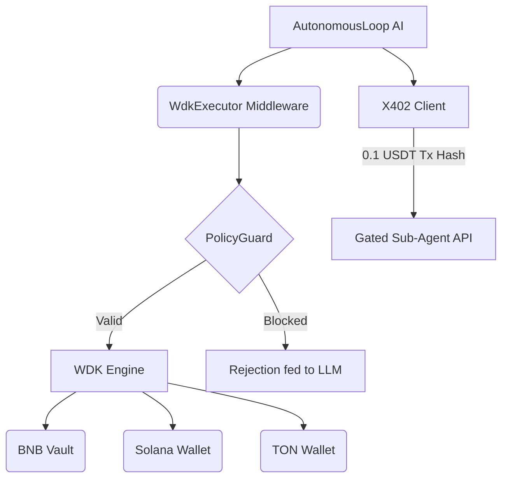

# OmniWDK: The Sovereign Yield Robot Fleet 🤖🚀

OmniWDK is an autonomous, non-custodial yield routing stack built for the **Hackathon Galáctica: WDK Edition 1**. 

While others build simple chatbots that can swap tokens, OmniWDK introduces a completely new paradigm: **an autonomous AI capital allocator managing a fleet of Multi-VM sub-agents**.

## 🏆 Why OmniWDK Wins (Hackathon Judging Criteria)

We analyzed the competition (`tsentry`, `shll-safe-agent`, `paymind-ai`, `ajo-agent`) and built OmniWDK to be technologically superior across all four judging metrics:

### 1. Technical Correctness (Provable PolicyGuard) 🛡️
Most competitors rely on "soft prompts" to tell the LLM not to drain funds. This is incredibly dangerous. OmniWDK implements a strict **PolicyGuard middleware** that intercepts raw WDK execution. 
- **Hard Limits:** Daily volume limits enforced at the code level, not the LLM level.
- **Whitelist:** Funds can only be sent to whitelisted smart contracts.
- **Feedback Loop:** If the LLM hallucinates a bad transaction, PolicyGuard blocks it, catches the error, and feeds the rejection reason *back into the LLM's context* so it learns and adjusts its strategy immediately.

### 2. Degree of Agent Autonomy (Adaptive Loop) ⚡
OmniWDK doesn't just run on a dumb cron job. The agent's `AutonomousLoop` dynamically schedules itself based on the current ZK-Risk level.
- High Risk = 5-minute polling to secure funds.
- Low Risk = 60-minute polling to save LLM tokens and RPC calls.

### 3. Economic Soundness (The X402 Robot Economy) 💸
Taking inspiration from the `x402` protocol (HTTP 402 Payment Required for machines), OmniWDK acts as a central brain that **hires sub-agents**.
- If the agent needs advanced risk analysis or off-chain data, it uses WDK to send a micro-payment (e.g., 0.1 USDT) to a sub-agent's address.
- The transaction hash acts as the cryptographic proof-of-payment (the `X-402-Payment-Hash` header) to unlock the gated API.
- **Result:** A self-sustaining machine-to-machine economy where AI pays AI using Tether.

### 4. Real-World Applicability (True Multi-VM Capability) 🌐
WDK's superpower is its abstraction over multiple blockchains. Competitors focused solely on EVM.
OmniWDK seamlessly registers and manages wallets across **BNB Chain (EVM)**, **Solana**, and **TON**.
- The agent actively monitors native and USDT balances across all three chains simultaneously, seeking cross-chain yield opportunities.

---

## 🏗️ Architecture



- **Backend:** Node.js / Hono / Vercel AI SDK / Tether WDK
- **Blockchain:** BNB Chain (Primary), Solana, TON
- **Contracts:** Custom ERC4626 Vault (`WDKVault`) + Strategy Engine (`AsterEngine`)
- **Frontend:** React / Vite / Tailwind

## 🚀 Quick Start

### 1. Install Dependencies
```bash
cd backend && pnpm install
cd ../frontend && pnpm install
```

### 2. Configure Environment
```bash
cd backend
cp .env.example .env.wdk
```
Edit `.env.wdk` with your `OPENROUTER_API_KEY`, `WDK_SECRET_SEED`, and `BNB_RPC_URL`.

### 3. Run the Stack
**Start the Backend (API + Autonomous Loop):**
```bash
cd backend
pnpm run dev
```

**Start the Frontend:**
```bash
cd frontend
pnpm run dev
```

## 🤖 The Autonomous Loop in Action
When you start the backend, the `AutonomousLoop` wakes up every 5-15 minutes (dynamically scheduled based on risk).
1. Checks balances across BNB, Solana, and TON.
2. Analyzes ZK-Risk.
3. Decides whether to hire an X402 sub-agent for more data.
4. Executes yielding, bridging, or sweeping via WDK.
