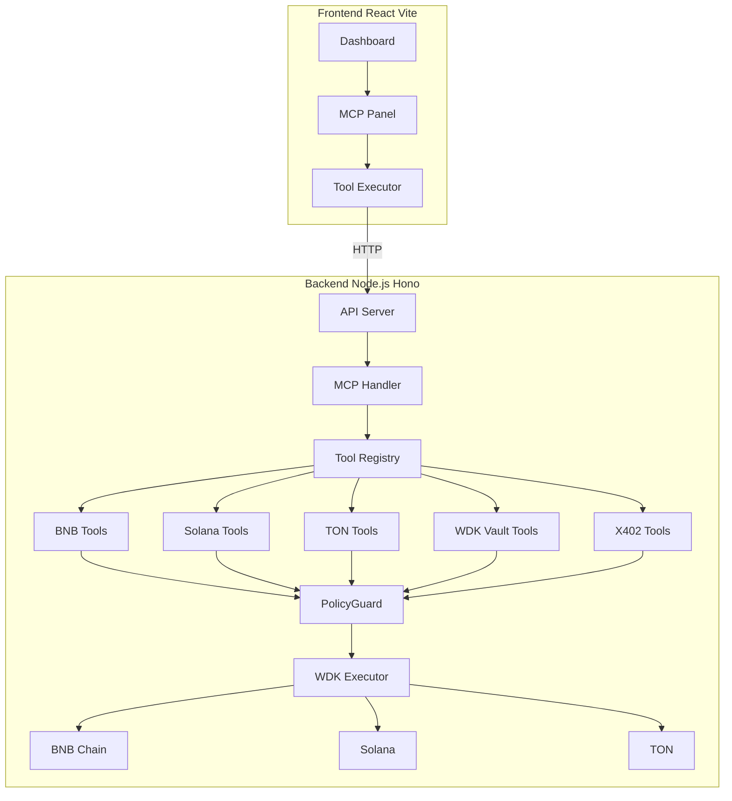
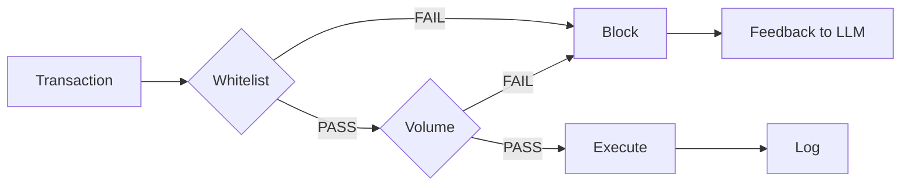

# OmniWDK: The Sovereign Yield Robot Fleet

OmniWDK is an autonomous, non-custodial yield routing stack built for Hackathon Galactica: WDK Edition 1. It introduces a new paradigm: an autonomous AI capital allocator managing a fleet of Multi-VM sub-agents.

## Why OmniWDK Wins

| Criteria | Description |
|----------|-------------|
| **Technical Correctness** | PolicyGuard middleware with hard limits enforced at code level |
| **Agent Autonomy** | Adaptive loop that dynamically schedules based on ZK-Risk level |
| **Economic Soundness** | X402 robot economy - AI pays AI using USDT |
| **Real-World Applicability** | True Multi-VM (BNB + Solana + TON) |

---

## How It Works

OmniWDK operates as an autonomous capital allocator:



### Autonomous Loop Flow


### PolicyGuard Security



---

## MCP Tools (32 Total)

| Category | Tools | Description |
|----------|-------|-------------|
| **X402** | 4 | Pay sub-agents, list services |
| **WDK Vault** | 4 | Deposit, withdraw, balance |
| **WDK Engine** | 3 | Execute cycle, risk metrics |
| **Aave** | 3 | Supply, withdraw, position |
| **BNB** | 7 | Wallet, transfer, swap |
| **Solana** | 4 | Wallet, transfer |
| **TON** | 3 | Wallet, transfer |

---

## Quick Start

### Prerequisites
- Node.js 18+
- pnpm 8+

### 1. Install

```bash
git clone https://github.com/your-repo/omnisdk.git
cd omnisdk

cd backend && pnpm install
cd ../frontend && pnpm install
```

---

## Backend Environment Setup

### Copy and Configure

```bash
cd backend
cp .env.example .env
```

### Required Variables

Edit `.env` with your values:

```bash
# Required: BIP-39 mnemonic (12-24 words) for the agent wallet
WDK_SECRET_SEED=""

# Required: OpenRouter API key for LLM calls
OPENROUTER_API_KEY=""

# Required: BNB Chain RPC URL
BNB_RPC_URL="https://bsc-testnet-dataseed.bnbchain.org"
```

### Optional Variables

```bash
# OpenRouter Model Configuration (defaults provided)
OPENROUTER_MODEL_GENERAL=google/gemini-2.0-flash-001
OPENROUTER_MODEL_CRYPTO=deepseek/deepseek-chat

# Solana RPC (default: https://api.mainnet-beta.solana.com)
SOLANA_RPC_URL=""

# TON RPC (default: https://toncenter.com/api/v2/jsonRPC)
TON_RPC_URL=""

# Private key for smart contract deployments (optional)
PRIVATE_KEY=""

# Server port (default: 3001)
PORT=3001
```

### Full Environment Variables Reference

| Variable | Required | Default | Description |
|----------|----------|---------|-------------|
| `WDK_SECRET_SEED` | Yes | - | BIP-39 mnemonic seed phrase |
| `OPENROUTER_API_KEY` | Yes | - | OpenRouter API key for LLM |
| `BNB_RPC_URL` | Yes | https://bsc-testnet-dataseed.bnbchain.org | BNB Chain RPC |
| `PORT` | No | 3001 | Server port |
| `PRIVATE_KEY` | No | Derived from WDK_SECRET_SEED | For deployments |
| `SOLANA_RPC_URL` | No | https://api.mainnet-beta.solana.com | Solana RPC |
| `TON_RPC_URL` | No | https://toncenter.com/api/v2/jsonRPC | TON RPC |
| `OPENROUTER_MODEL_GENERAL` | No | google/gemini-2.0-flash-001 | General LLM model |
| `OPENROUTER_MODEL_CRYPTO` | No | deepseek/deepseek-chat | Crypto LLM model |

---

## Frontend Environment Setup

### Copy and Configure

```bash
cd frontend
cp .env.example .env
```

### Required Variables

```bash
# Default network (testnet, mainnet)
VITE_DEFAULT_NETWORK=testnet

# API URL pointing to backend
VITE_API_URL=http://localhost:3001
```

### Optional Variables

```bash
# BNB Testnet RPC (default provided)
VITE_BSC_TESTNET_RPC_URL=https://bsc-testnet-rpc.publicnode.com

# Testnet Contract Addresses (optional - defaults provided)
VITE_TESTNET_VAULT_ADDRESS=
VITE_TESTNET_ENGINE_ADDRESS=
VITE_TESTNET_TOKEN_ADDRESS=

# Mainnet Contract Addresses (optional)
VITE_MAINNET_VAULT_ADDRESS=
VITE_MAINNET_ENGINE_ADDRESS=
VITE_MAINNET_TOKEN_ADDRESS=

# WalletConnect Project ID (get from https://cloud.walletconnect.com)
VITE_WALLETCONNECT_PROJECT_ID=
```

### Full Environment Variables Reference

| Variable | Required | Default | Description |
|----------|----------|---------|-------------|
| `VITE_DEFAULT_NETWORK` | Yes | testnet | Network mode |
| `VITE_API_URL` | Yes | http://localhost:3001 | Backend API URL |
| `VITE_WALLETCONNECT_PROJECT_ID` | No | - | WalletConnect project ID |
| `VITE_BSC_TESTNET_RPC_URL` | No | https://bsc-testnet-rpc.publicnode.com | BNB Testnet RPC |
| `VITE_TESTNET_VAULT_ADDRESS` | No | - | Vault contract (testnet) |
| `VITE_TESTNET_ENGINE_ADDRESS` | No | - | Engine contract (testnet) |
| `VITE_TESTNET_TOKEN_ADDRESS` | No | - | USDT contract (testnet) |
| `VITE_MAINNET_VAULT_ADDRESS` | No | - | Vault contract (mainnet) |
| `VITE_MAINNET_ENGINE_ADDRESS` | No | - | Engine contract (mainnet) |
| `VITE_MAINNET_TOKEN_ADDRESS` | No | - | USDT contract (mainnet) |

---

## Run the Application

### Start Backend

```bash
cd backend
pnpm run dev
```

Expected output:
```
Server ready: http://localhost:3001
[MCP] Registered 30 tools
[AutonomousLoop] Starting...
```

### Start Frontend

```bash
cd frontend
pnpm run dev
```

Open http://localhost:5173

---

## Unified Backend Architecture

OmniWDK uses a **unified backend server** approach where all services run as HTTP/SSE endpoints within a single Hono application process. This eliminates the complexity of managing multiple spawned processes.

### Architecture Benefits

| Aspect | Unified Approach | Multi-Process Approach |
|--------|------------------|------------------------|
| **Deployment** | Single process to manage | Multiple processes to coordinate |
| **Communication** | Direct function calls | Inter-process communication (IPC) |
| **Debugging** | Single log stream | Multiple log streams to correlate |
| **Resource Usage** | Shared memory and connections | Duplicated resources per process |
| **Scaling** | Horizontal (replicas) | Vertical (process management) |

### Endpoint Overview

All services are exposed as REST/SSE endpoints:

```typescript
// MCP Tools - JSON-RPC over HTTP
POST /api/mcp
{
  "jsonrpc": "2.0",
  "method": "tools/call",
  "params": { "name": "bnb_getBalance", "arguments": {} }
}

// Dashboard Events - Server-Sent Events (SSE)
GET /api/dashboard/events
// Streams: cycle:start, step:finish, cycle:end, cycle:error

// Robot Fleet - SSE + REST
GET /api/robot-fleet/events     // SSE stream
GET /api/robot-fleet/status     // REST status
```

### Implementation Details

The main server (`backend/src/index.ts`) registers all route handlers:

```typescript
app.route('/api/stats', statsRoute);
app.route('/api/chat', chatRoute);
app.route('/api/agent', agentRoute);
app.route('/api/dashboard', dashboardRoute);  // SSE for autonomous loop
app.route('/api/robot-fleet', robotFleetRoute); // SSE for robot events
app.route('/api/x402', x402Route);
app.route('/api/mcp', mcpRoute);               // MCP HTTP endpoint
```

**Key Files:**
- `backend/src/api/routes/mcp.ts` - MCP HTTP handler (JSON-RPC)
- `backend/src/api/routes/dashboard.ts` - SSE dashboard events
- `backend/src/api/routes/robot-fleet.ts` - Robot fleet SSE + REST
- `backend/src/services/RobotFleetService.ts` - In-process fleet manager
- `backend/src/mcp-server/tool-registry.ts` - Tool registration system
- `backend/src/mcp-server/handlers/` - Tool implementations (BNB, Solana, TON, WDK, X402, ERC4337)

---

## MCP Panel Usage

1. Connect Wallet in header
2. Expand category (X402, Vault, Engine, Aave)
3. Click the button on any tool to show parameters
4. Enter required parameters
5. Click Execute

### Test Commands

```bash
# Check balance
curl -X POST http://localhost:3001/api/mcp \
  -H "Content-Type: application/json" \
  -d '{"jsonrpc":"2.0","id":1,"method":"tools/call","params":{"name":"bnb_getBalance","arguments":{}}}'

# List tools
curl -X POST http://localhost:3001/api/mcp \
  -H "Content-Type: application/json" \
  -d '{"jsonrpc":"2.0","id":1,"method":"tools/list"}'
```

---

## Project Structure

```
omnisdk/
├── backend/
│   ├── src/
│   │   ├── api/routes/mcp.ts      # MCP endpoint
│   │   ├── agent/middleware/PolicyGuard.ts
│   │   ├── mcp-server/handlers/  # Tool implementations
│   │   │   ├── bnb-tools.ts
│   │   │   ├── solana-tools.ts
│   │   │   ├── ton-tools.ts
│   │   │   ├── wdk-tools.ts
│   │   │   └── x402-tools.ts
│   │   └── contracts/            # Solidity
│   ├── hardhat.config.js
│   └── .env.example
├── frontend/
│   ├── src/
│   │   └── components/dashboard/MCPServerDemo.tsx
│   ├── vite.config.ts
│   └── .env.example
└── README.md
```

---

## Scripts

```bash
# Backend
pnpm run dev          # Development server (includes MCP HTTP endpoint)
pnpm run build        # Production build
pnpm run start        # Production server
pnpm test            # Run tests
pnpm run compile     # Compile Solidity contracts
pnpm robot:start     # Start robot fleet simulator (standalone)
pnpm robot:dev       # Robot fleet in watch mode

# Frontend
pnpm run dev         # Development server
pnpm run build       # Production build

# E2E Testing (Playwright)
cd frontend
pnpm playwright test              # Run all tests (headless)
pnpm playwright test --headed     # Run tests with visible browser
pnpm playwright test mcp-api.spec.ts --headed  # Run specific test file
```

**Note:** All services (MCP, SSE Dashboard, Robot Fleet) run as unified endpoints in the main backend server. No separate processes are spawned.

---

## Deploy Smart Contracts (Complete Guide)

### Prerequisites

**1. Get Testnet BNB Tokens**
- Visit [BNB Testnet Faucet](https://testnet.bnbchain.org/faucet-smart)
- Request testnet BNB for deployment (~0.5 BNB recommended)
- Verify balance on [BSCScan Testnet](https://testnet.bscscan.com)

**2. Configure Environment**

Edit `backend/.env` and add:
```bash
# Required for deployment
PRIVATE_KEY="your-wallet-private-key-here"

# Network RPC
BNB_RPC_URL="https://bsc-testnet-dataseed.bnbchain.org"
```

**Security Note:** Never commit your private key or share it. Use a dedicated testnet wallet.

---

### Step-by-Step Deployment

#### Step 1: Install Dependencies

```bash
cd backend
pnpm install
```

#### Step 2: Compile Contracts

```bash
pnpm run compile
```

Expected output:
```
Compiled 45 Solidity files successfully
```

#### Step 3: Deploy Core Contracts

```bash
npx hardhat run scripts/DeployStackWithSeed.ts --network bnbTestnet
```

This deploys (in order):
1. **Mock ERC20 Tokens** - USDT, XAUT test tokens
2. **Mock Oracles** - Price feeds for USDT/USD, XAUT/USD
3. **Risk Policy** - Risk management parameters
4. **WDK Vault** - Main vault for deposits
5. **WDK Engine** - Execution engine with rebalancing logic
6. **Adapters** - XAUT, Secondary, LP, Lending adapters
7. **Circuit Breaker** - Emergency pause mechanism

**Expected Output:**
```
=== Phase 1: Deploy Tokens ===
USDT deployed: 0x...
XAUT deployed: 0x...

=== Phase 2: Deploy Oracles ===
USDT Oracle: 0x...
XAUT Oracle: 0x...

=== Phase 3: Deploy Core ===
WDK Vault: 0x...
WDK Engine: 0x...
...

--- Deployment Complete ---
```

**Important:** Save these addresses - you'll need them in Step 5.

#### Step 4: Deploy ZK Risk Oracle (Critical)

The main deployment script has a bug and doesn't deploy the ZK Risk Oracle. Deploy it separately:

```bash
npx hardhat run scripts/deploy-zk-oracle.ts --network bnbTestnet
```

**Expected Output:**
```
Deploying ZKRiskOracle...
ZKRiskOracle deployed to: 0x6270359cBb1EB483f9630712e9D101845D39d524
✅ Updated .env with WDK_ZK_ORACLE_ADDRESS
```

#### Step 5: Update Environment File

The deployment scripts auto-update `.env`, but verify all addresses are present:

```bash
# Core Contracts
WDK_VAULT_ADDRESS=0xcB411a907e47047da98B38C99A683c6FAF2AA87A
WDK_ENGINE_ADDRESS=0x0b33c994825c88484387E73D1F75967CeE79Cf25

# Tokens
WDK_USDT_ADDRESS=0xdea54eC5150Aa35ef2686b02EdD20b050430Ad7D
WDK_XAUT_ADDRESS=0x3CfeB85C9E4063c622255FD216055bF3058eb32e

# Oracles
WDK_ZK_ORACLE_ADDRESS=0x6270359cBb1EB483f9630712e9D101845D39d524
WDK_USDT_ORACLE_ADDRESS=0xC3D519Ed04E55BFe67732513109bBBF6c959471D
WDK_XAUT_ORACLE_ADDRESS=0x9Da68499a9B4acB7641f3CBBd2f4F51062D6b57B

# Adapters
WDK_XAUT_ADAPTER_ADDRESS=0x06C390c4a68A9289Ba3366d6f023907970421120
WDK_SECONDARY_ADAPTER_ADDRESS=0x759ae06e462Ac0000D0A34578dF0A15fC390cDd6
WDK_LP_ADAPTER_ADDRESS=0xc3704bdbBe7E3c51180Bc219629E36a21795f7e0
WDK_LENDING_ADAPTER_ADDRESS=0x4774285a7Cd9711Ae396e1EDD0Bcf6d093bEa1bb

# Circuit Breaker
WDK_BREAKER_ADDRESS=0x03408d440E2d9cd31D744469f111AaaBb121A844

# Network
BNB_RPC_URL=https://bsc-testnet-dataseed.bnbchain.org
```

#### Step 6: Seed Vault with Initial Funds

The deployment may leave the vault empty. Fund it manually:

```bash
npx hardhat run scripts/seed-vault.ts --network bnbTestnet
```

**Expected Output:**
```
Minting 100,000 USDT...
Approving vault...
Depositing into vault...
✅ Vault seeded successfully
Vault balance: 100000.0 USDT
```

#### Step 7: Verify Deployment

Test the backend API:

```bash
# Start backend server
pnpm run dev

# In another terminal, test stats endpoint
curl http://localhost:3001/api/stats
```

**Expected Response:**
```json
{
  "vault": {
    "totalAssets": "100000.0",
    "bufferUtilizationBps": "3333"
  },
  "risk": {
    "level": "LOW",
    "drawdownBps": 0
  },
  "system": {
    "isPaused": false,
    "canExecute": true
  }
}
```

---

### BNB Testnet Deployment (Reference Addresses)

**Latest Verified Deployment:**

| Contract | Address | Explorer |
|----------|---------|----------|
| **WDK Vault** | `0xcB411a907e47047da98B38C99A683c6FAF2AA87A` | [View on BSCScan](https://testnet.bscscan.com/address/0xcB411a907e47047da98B38C99A683c6FAF2AA87A) |
| **WDK Engine** | `0x0b33c994825c88484387E73D1F75967CeE79Cf25` | [View on BSCScan](https://testnet.bscscan.com/address/0x0b33c994825c88484387E73D1F75967CeE79Cf25) |
| **USDT Token** | `0xdea54eC5150Aa35ef2686b02EdD20b050430Ad7D` | [View on BSCScan](https://testnet.bscscan.com/address/0xdea54eC5150Aa35ef2686b02EdD20b050430Ad7D) |
| **XAUT Token** | `0x3CfeB85C9E4063c622255FD216055bF3058eb32e` | [View on BSCScan](https://testnet.bscscan.com/address/0x3CfeB85C9E4063c622255FD216055bF3058eb32e) |
| **ZK Risk Oracle** | `0x6270359cBb1EB483f9630712e9D101845D39d524` | [View on BSCScan](https://testnet.bscscan.com/address/0x6270359cBb1EB483f9630712e9D101845D39d524) |
| **USDT Oracle** | `0xC3D519Ed04E55BFe67732513109bBBF6c959471D` | [View on BSCScan](https://testnet.bscscan.com/address/0xC3D519Ed04E55BFe67732513109bBBF6c959471D) |
| **XAUT Oracle** | `0x9Da68499a9B4acB7641f3CBBd2f4F51062D6b57B` | [View on BSCScan](https://testnet.bscscan.com/address/0x9Da68499a9B4acB7641f3CBBd2f4F51062D6b57B) |
| **Circuit Breaker** | `0x03408d440E2d9cd31D744469f111AaaBb121A844` | [View on BSCScan](https://testnet.bscscan.com/address/0x03408d440E2d9cd31D744469f111AaaBb121A844) |
| **XAUT Adapter** | `0x06C390c4a68A9289Ba3366d6f023907970421120` | [View on BSCScan](https://testnet.bscscan.com/address/0x06C390c4a68A9289Ba3366d6f023907970421120) |
| **Secondary Adapter** | `0x759ae06e462Ac0000D0A34578dF0A15fC390cDd6` | [View on BSCScan](https://testnet.bscscan.com/address/0x759ae06e462Ac0000D0A34578dF0A15fC390cDd6) |
| **LP Adapter** | `0xc3704bdbBe7E3c51180Bc219629E36a21795f7e0` | [View on BSCScan](https://testnet.bscscan.com/address/0xc3704bdbBe7E3c51180Bc219629E36a21795f7e0) |
| **Lending Adapter** | `0x4774285a7Cd9711Ae396e1EDD0Bcf6d093bEa1bb` | [View on BSCScan](https://testnet.bscscan.com/address/0x4774285a7Cd9711Ae396e1EDD0Bcf6d093bEa1bb) |

**Deployment Date:** January 24, 2025  
**Network:** BNB Testnet (Chain ID: 97)  
**Total Vault Assets:** 150,000 USDT

---

### Deploy to Local Hardhat Node

For local development and testing:

```bash
# Terminal 1: Start local node
cd backend
pnpm run node

# Terminal 2: Deploy
npx hardhat run scripts/DeployStackWithSeed.ts --network localhost
npx hardhat run scripts/deploy-zk-oracle.ts --network localhost
npx hardhat run scripts/seed-vault.ts --network localhost
```

**Local Network Configuration:**
- RPC URL: `http://127.0.0.1:8545`
- Chain ID: `31337`
- No testnet tokens needed

---

## Troubleshooting

### Empty Vault After Deployment

**Symptom:** Vault `totalAssets` shows near-zero value (e.g., 0.00000005 USDT)

**Cause:** The deployment script `DeployStackWithSeed.ts` has known issues:
- Line 177: Assigns `usdtOracleAddr` instead of deploying `ZKRiskOracle`
- Phase 6 (seeding) may not execute, leaving vault unfunded

**Solution:** Use the manual seeding script:

```bash
cd backend
npx hardhat run scripts/seed-vault.ts --network bnbTestnet
```

This script will:
1. Mint 100,000 USDT to deployer
2. Approve vault to spend USDT
3. Deposit into vault

### Stats Endpoint Error (CALL_EXCEPTION)

**Symptom:** `/api/stats` endpoint fails with `CALL_EXCEPTION` when calling `zkOracle.getVerifiedRiskBands()`

**Cause:** `WDK_ZK_ORACLE_ADDRESS` in `.env` points to wrong contract (e.g., MockPriceOracle instead of ZKRiskOracle)

**Solution:** Deploy ZKRiskOracle separately:

```bash
cd backend
npx hardhat run scripts/deploy-zk-oracle.ts --network bnbTestnet
```

The script auto-updates `.env` with the correct oracle address.

### Environment File Confusion

**Important:** Use only `.env` file (not `.env.wdk.local`). All scripts and documentation reference `.env` as the primary configuration file.

---

OmniWDK: Where robots manage robots' money.
