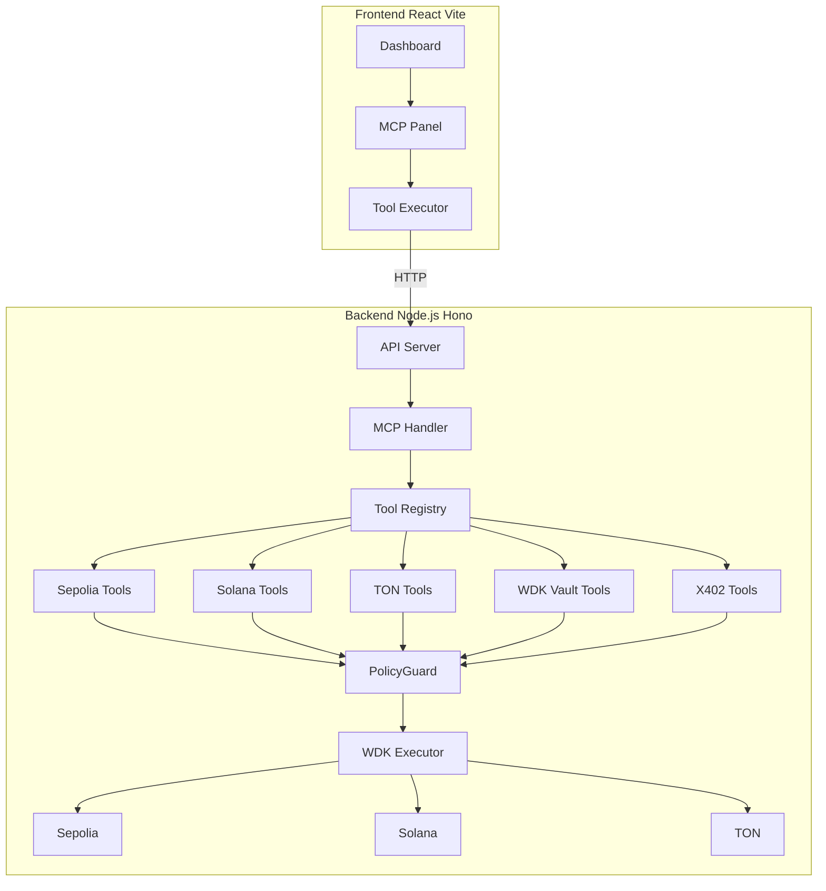
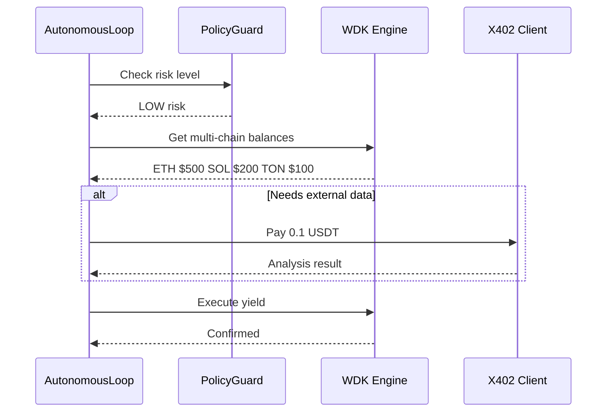
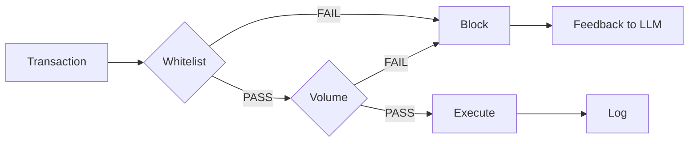
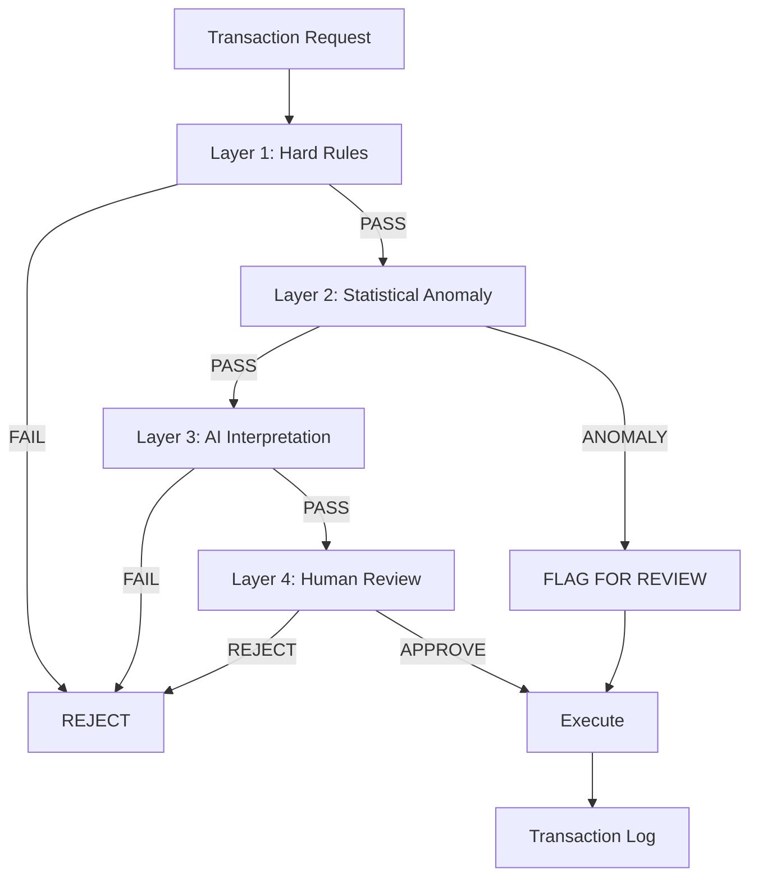

# OmniAgent: The Sovereign Yield Robot Fleet

<div align="center">
  
</div>

<div align="center">

[](https://opensource.org/licenses/Apache-2.0)
[](https://nodejs.org/)
[](https://www.typescriptlang.org/)
[](https://react.dev/)
[](https://soliditylang.org/)
[](https://github.com/OmniAgent)
[](https://x402.org/)

</div>

OmniAgent is an autonomous, non-custodial yield routing stack. It introduces a new paradigm: an autonomous AI capital allocator managing a fleet of Multi-VM sub-agents.

## Why OmniAgent Wins

| Criteria | Description |
|----------|-------------|
| **Technical Correctness** | PolicyGuard middleware with hard limits enforced at code level |
| **Agent Autonomy** | Adaptive loop that dynamically schedules based on ZK-Risk level |
| **Economic Soundness** | X402 robot economy - AI pays AI using USDT |
| **Real-World Applicability** | True Multi-VM (Sepolia + Solana + TON) |
| **Visible Reasoning** | AI thinking shown in real-time via native model reasoning |
| **Dynamic Suggestions** | Contextual follow-up prompts generated from full conversation |
| **Safety-First** | Circuit breaker, oracle freshness, HF velocity monitoring |
| **Multi-Protocol Yield** | Aave lending, USDT0 bridge, Velora swap via WDK modules |
| **Statistical Anomaly Detection** | Z-score + IQR outlier detection (auditability) |
| **On-Chain Policy Enforcement** | B-scheme blocks raw WDK writes |
| **4-Layer Governance Pipeline** | Hard Rules → Anomaly → AI → Human review |
| **Adaptive Scheduling** | Volatility-based polling (30s → 1h) |

---

## How It Works

OmniAgent operates as an autonomous capital allocator:



### Autonomous Loop Flow



### PolicyGuard Security



### 4-Layer Governance Pipeline

The autonomous agent implements a 4-layer governance pipeline for transaction approval:



| Layer | Check | Action on Fail |
|-------|-------|----------------|
| **Hard Rules** | Whitelist, daily limits, NAV shield | REJECT |
| **Anomaly Detection** | Z-score + IQR statistical outlier | FLAG or REJECT |
| **AI Interpretation** | LLM reasoning on transaction intent | FLAG or REJECT |
| **Human Review** | Manual approval queue | APPROVE/REJECT |

### Statistical Anomaly Detection

OmniAgent uses statistical methods to detect unusual transaction patterns:

| Method | Description | Threshold |
|--------|-------------|-----------|
| **Z-Score** | Measures deviation from historical mean | >3.0 = anomaly |
| **IQR** | Interquartile range outlier detection | <Q1-1.5×IQR or >Q3+1.5×IQR |
| **Cold-Start** | Fallback when insufficient history | Auto-approve |

### Adaptive Scheduling

The agent dynamically adjusts its polling interval based on market conditions:

| Volatility | Health Factor | Poll Interval |
|------------|---------------|---------------|
| High (>5%) | <1.5 | 30 seconds |
| Medium (2-5%) | 1.5-2.0 | 5 minutes |
| Low (<2%) | >2.0 | 1 hour |

### Autonomous Agent & Safety

The autonomous agent manages yield routing with multi-layered safety:

| Safety Feature | Threshold | Action |
|----------------|-----------|--------|
| **Circuit Breaker** | 3 consecutive failures | Auto-trip, 60s cooldown |
| **Oracle Freshness** | 300s max age | Reject stale price data |
| **Health Factor Velocity** | >0.1/min change | Emergency stop |
| **Emergency HF** | <1.5 (1.2 critical) | Forced withdrawal |

**Autonomous Decision Loop:**
1. Fetch Aave account data & market conditions
2. Validate oracle freshness (reject stale data)
3. Check circuit breaker status
4. Calculate HF velocity (rate of change)
5. Decide: supply USDT, supply XAUT, withdraw, or hold
6. Execute with safety checks
7. Log decision with full reasoning

```typescript
// Key safety constants
MAX_CONSECUTIVE_FAILURES = 3
MIN_HEALTH_FACTOR = 1.5
EMERGENCY_HEALTH_FACTOR = 1.2
ORACLE_MAX_AGE_SECONDS = 300
HEALTH_FACTOR_VELOCITY_THRESHOLD = 0.1/min
```

---

## MCP Tools (40+ Total)

| Category | Tools | Description |
|----------|-------|-------------|
| **X402** | 5 | Pay sub-agents, fleet status, list services |
| **WDK Vault** | 6 | Deposit, withdraw, balance, state |
| **WDK Engine** | 3 | Execute cycle, risk metrics |
| **WDK Protocol** | 9 | Aave lending, USDT0 bridge, Velora swap, autonomous cycle |
| **Sepolia** | 7 | Wallet, transfer, swap, bridge, Aave |
| **Solana** | 4 | Wallet, transfer, swap |
| **TON** | 3 | Wallet, transfer |
| **ERC4337** | 12+ | Smart account management |
| **Robot Fleet** | 4 | Status, start, events, robots |

### WDK Protocol Tools (9 tools)

| Tool | Description | Risk |
|------|-------------|------|
| `wdk_lending_supply` | Supply tokens to Aave lending pool | Medium |
| `wdk_lending_withdraw` | Withdraw from Aave | Medium |
| `wdk_lending_borrow` | Borrow from Aave | High |
| `wdk_lending_repay` | Repay Aave debt | Medium |
| `wdk_lending_getPosition` | Get Aave position & health factor | Low |
| `wdk_bridge_usdt0` | Bridge USDT across chains | Medium |
| `wdk_swap_tokens` | Swap tokens via Velora | Medium |
| `wdk_autonomous_cycle` | Run autonomous yield decision cycle | High |
| `wdk_autonomous_status` | Get agent state & last decision | Low |

---

## Quick Start

### Prerequisites
- Node.js 18+
- pnpm 8+

### 1. Install

```bash
git clone https://github.com/your-repo/omnisdk.git
cd omnisdk

cd backend && pnpm install
cd ../frontend && pnpm install
```

---

## Backend Environment Setup

### Copy and Configure

```bash
cd backend
cp .env.example .env
```

### Required Variables

Edit `.env` with your values:

```bash
# Required: BIP-39 mnemonic (12-24 words) for the agent wallet
WDK_SECRET_SEED=""

# Required: OpenRouter API key for LLM calls
OPENROUTER_API_KEY=""

# Required: Sepolia RPC URL
SEPOLIA_RPC_URL="https://ethereum-sepolia.publicnode.com"
```

### Optional Variables

```bash
# OpenRouter Model Configuration (defaults provided)
OPENROUTER_MODEL_GENERAL=google/gemini-2.5-flash-lite
OPENROUTER_MODEL_CRYPTO=x-ai/grok-4o-mini

# Robot Fleet Configuration
ROBOT_FLEET_ENABLED=false
ROBOT_FLEET_SIZE=8
ROBOT_FLEET_TASK_INTERVAL_MIN=5000
ROBOT_FLEET_TASK_INTERVAL_MAX=15000
ROBOT_FLEET_EARNINGS_MIN=0.0001
ROBOT_FLEET_EARNINGS_MAX=0.0025
ROBOT_FLEET_AGENT_WALLET=
# ROBOT_FLEET_ROBOTS=[{"id":"ROBO-001","type":"Yield Sentry","icon":"[S]"},...]

# Logging (default: info)
LOG_LEVEL=info
NODE_ENV=development

# Allow autonomous agent loop (default: true)
ALLOW_AGENT_RUN=true

# Agent reporting (optional - for agent status notifications)
AGENT_REPORT_WEBHOOK_URL=
AGENT_REPORT_INTERVAL_MS=60000

# Solana RPC (default: https://api.mainnet-beta.solana.com)
SOLANA_RPC_URL=""

# TON RPC (default: https://toncenter.com/api/v2/jsonRPC)
TON_RPC_URL=""

# Private key for smart contract deployments (optional)
PRIVATE_KEY=""

# Server port (default: 3001)
PORT=3001

# Mock Contracts for Testnet (deployed via DeployMockAaveAndBridge.ts)
MOCK_AAVE_POOL_ADDRESS=0xa9B209611603CE09bEbCFF63a1A3d44D0C4A6f48
MOCK_BRIDGE_ADDRESS=0x8c3E36830eD27759C0f65A665D067Fe77041aa0C
```

### Full Environment Variables Reference

| Variable | Required | Default | Description |
|----------|----------|---------|-------------|
| `WDK_SECRET_SEED` | Yes | - | BIP-39 mnemonic seed phrase |
| `OPENROUTER_API_KEY` | Yes | - | OpenRouter API key for LLM |
| `SEPOLIA_RPC_URL` | Yes | https://ethereum-sepolia.publicnode.com | Sepolia RPC |
| `PORT` | No | 3001 | Server port |
| `PRIVATE_KEY` | No | Derived from WDK_SECRET_SEED | For deployments |
| `SOLANA_RPC_URL` | No | https://api.mainnet-beta.solana.com | Solana RPC |
| `TON_RPC_URL` | No | https://toncenter.com/api/v2/jsonRPC | TON RPC |
| `OPENROUTER_MODEL_GENERAL` | No | google/gemini-2.5-flash-lite | General LLM model |
| `OPENROUTER_MODEL_CRYPTO` | No | x-ai/grok-4o-mini | Crypto LLM model (supports reasoning) |
| `ROBOT_FLEET_ENABLED` | No | false | Enable robot fleet simulator |
| `ROBOT_FLEET_SIZE` | No | 8 | Number of virtual robots |
| `ROBOT_FLEET_AGENT_WALLET` | No | Derived from WDK_SECRET_SEED | Robot fleet agent wallet |
| `LOG_LEVEL` | No | info | Log verbosity (debug, info, warn, error) |
| `NODE_ENV` | No | development | Node environment |
| `ALLOW_AGENT_RUN` | No | true | Enable autonomous loop |
| `AGENT_REPORT_WEBHOOK_URL` | No | - | Webhook for agent status |
| `AGENT_REPORT_INTERVAL_MS` | No | 60000 | Status report interval |
| `SEPOLIA_RPC_URL` | No | https://sepolia.infura.io | Sepolia RPC for WDK protocols |
| `WDK_USDT_ADDRESS` | No | - | USDT token address (Sepolia) |
| `WDK_XAUT_ADDRESS` | No | - | XAUT token address (Sepolia) |
| `WDK_ZK_ORACLE_ADDRESS` | No | - | ZK Risk Oracle address |
| `WDK_USDT_ORACLE_ADDRESS` | No | - | USDT price oracle address |
| `WDK_XAUT_ORACLE_ADDRESS` | No | - | XAUT price oracle address |
| `WDK_BREAKER_ADDRESS` | No | - | Circuit breaker contract |

---

## Frontend Environment Setup

### Copy and Configure

```bash
cd frontend
cp .env.example .env
```

### Required Variables

```bash
# Default network (testnet, mainnet)
VITE_DEFAULT_NETWORK=testnet

# API URL pointing to backend
VITE_API_URL=http://localhost:3001
```

### Optional Variables

```bash
# Sepolia RPC (default provided)
VITE_SEPOLIA_RPC_URL=https://ethereum-sepolia.publicnode.com

# Testnet Contract Addresses (optional - defaults provided)
VITE_TESTNET_VAULT_ADDRESS=
VITE_TESTNET_ENGINE_ADDRESS=
VITE_TESTNET_TOKEN_ADDRESS=

# Mainnet Contract Addresses (optional)
VITE_MAINNET_VAULT_ADDRESS=
VITE_MAINNET_ENGINE_ADDRESS=
VITE_MAINNET_TOKEN_ADDRESS=

# WalletConnect Project ID (get from https://cloud.walletconnect.com)
VITE_WALLETCONNECT_PROJECT_ID=
```

### Full Environment Variables Reference

| Variable | Required | Default | Description |
|----------|----------|---------|-------------|
| `VITE_DEFAULT_NETWORK` | Yes | testnet | Network mode |
| `VITE_API_URL` | Yes | http://localhost:3001 | Backend API URL |
| `VITE_WALLETCONNECT_PROJECT_ID` | No | - | WalletConnect project ID |
| `VITE_SEPOLIA_RPC_URL` | No | https://ethereum-sepolia.publicnode.com | Sepolia RPC |
| `VITE_TESTNET_VAULT_ADDRESS` | No | - | Vault contract (testnet) |
| `VITE_TESTNET_ENGINE_ADDRESS` | No | - | Engine contract (testnet) |
| `VITE_TESTNET_TOKEN_ADDRESS` | No | - | USDT contract (testnet) |
| `VITE_MAINNET_VAULT_ADDRESS` | No | - | Vault contract (mainnet) |
| `VITE_MAINNET_ENGINE_ADDRESS` | No | - | Engine contract (mainnet) |
| `VITE_MAINNET_TOKEN_ADDRESS` | No | - | USDT contract (mainnet) |

---

## Run the Application

### Start Backend

```bash
cd backend
pnpm run dev
```

Expected output:
```
Server ready: http://localhost:3001
[MCP] Registered 40+ tools
[AutonomousLoop] Starting...
```

### Start Frontend

```bash
cd frontend
pnpm run dev
```

Open http://localhost:5173

---

## Unified Backend Architecture

OmniAgent uses a **unified backend server** approach where all services run as HTTP/SSE endpoints within a single Hono application process. This eliminates the complexity of managing multiple spawned processes.

### Architecture Benefits

| Aspect | Unified Approach | Multi-Process Approach |
|--------|------------------|------------------------|
| **Deployment** | Single process to manage | Multiple processes to coordinate |
| **Communication** | Direct function calls | Inter-process communication (IPC) |
| **Debugging** | Single log stream | Multiple log streams to correlate |
| **Resource Usage** | Shared memory and connections | Duplicated resources per process |
| **Scaling** | Horizontal (replicas) | Vertical (process management) |

### Endpoint Overview

All services are exposed as REST/SSE endpoints:

```typescript
// MCP Tools - JSON-RPC over HTTP
POST /api/mcp
{
  "jsonrpc": "2.0",
  "method": "tools/call",
  "params": { "name": "sepolia_get_balance", "arguments": {} }
}

// Chat - Streaming AI with tool execution + suggestions
POST /api/chat
// Streams: reasoning, tool calls, text deltas, suggestions
// Returns: SSE with message parts + dynamic follow-up prompts

// Dashboard Events - Server-Sent Events (SSE)
GET /api/dashboard/events
// Streams: cycle:start, step:finish, cycle:end, cycle:error

// Stats - Current vault, risk, and system status
GET /api/stats

// Robot Fleet - SSE + REST
GET /api/robot-fleet/events     // SSE stream
GET /api/robot-fleet/status     // REST status
```

### Implementation Details

The main server (`backend/src/index.ts`) registers all route handlers:

```typescript
app.route('/api/stats', statsRoute);
app.route('/api/chat', chatRoute);
app.route('/api/agent', agentRoute);
app.route('/api/dashboard', dashboardRoute);  // SSE for autonomous loop
app.route('/api/robot-fleet', robotFleetRoute); // SSE for robot events
app.route('/api/x402', x402Route);
app.route('/api/mcp', mcpRoute);               // MCP HTTP endpoint
```

**Key Files:**
- `backend/src/api/routes/chat.ts` - Streaming AI chat + dynamic suggestions
- `backend/src/api/routes/mcp.ts` - MCP HTTP handler (JSON-RPC)
- `backend/src/api/routes/stats.ts` - Vault/risk system stats
- `backend/src/api/routes/dashboard.ts` - SSE dashboard events
- `backend/src/api/routes/robot-fleet.ts` - Robot fleet SSE + REST
- `backend/src/services/AutonomousAgent.ts` - Decision loop with safety mechanisms
- `backend/src/services/WdkProtocolService.ts` - Aave/Bridge/Swap protocol wrappers
- `backend/src/services/WdkSignerAdapter.ts` - WDK → ethers.js signer adapter
- `backend/src/mcp-server/tool-registry.ts` - Tool registration system
- `backend/src/mcp-server/handlers/` - Tool implementations (Sepolia, Solana, TON, WDK, X402, ERC4337)

---

## MCP Panel Usage

1. Connect Wallet in header
2. Expand category (X402, Vault, Engine, Aave)
3. Click the button on any tool to show parameters
4. Enter required parameters
5. Click Execute

### Test Commands

```bash
# Check balance
curl -X POST http://localhost:3001/api/mcp \
  -H "Content-Type: application/json" \
  -d '{"jsonrpc":"2.0","id":1,"method":"tools/call","params":{"name":"sepolia_get_balance","arguments":{}}}'

# List tools
curl -X POST http://localhost:3001/api/mcp \
  -H "Content-Type: application/json" \
  -d '{"jsonrpc":"2.0","id":1,"method":"tools/list"}'
```

---

## Project Structure

```
OmniAgent/
├── backend/
│   ├── src/
│   │   ├── api/routes/
│   │   │   ├── chat.ts           # Streaming AI chat + suggestions
│   │   │   ├── mcp.ts           # MCP HTTP endpoint
│   │   │   ├── stats.ts          # Vault/risk system stats
│   │   │   └── dashboard.ts      # SSE dashboard events
│   │   ├── agent/                # Autonomous loop + PolicyGuard
│   │   ├── services/
│   │   │   ├── AutonomousAgent.ts    # Decision loop + safety
│   │   │   ├── WdkProtocolService.ts  # Aave/Bridge/Swap modules
│   │   │   └── WdkSignerAdapter.ts   # WDK → ethers.js bridge
│   │   ├── mcp-server/handlers/
│   │   │   ├── wdk-vault-tools.ts     # Vault deposit/withdraw
│   │   │   ├── wdk-engine-tools.ts    # Engine execution
│   │   │   └── wdk-protocol-tools.ts  # Aave/Bridge/Swap/Autonomous
│   │   └── config/               # Env config, security, robot fleet
│   ├── hardhat.config.js
│   └── .env.example
├── frontend/
│   ├── src/
│   │   ├── App.tsx              # Chat UI with streaming + suggestions
│   │   └── components/
│   └── .env.example
└── README.md
```

---

## Scripts

```bash
# Backend
pnpm run dev          # Development server (includes MCP HTTP endpoint)
pnpm run build        # Production build
pnpm run start        # Production server
pnpm test            # Run tests
pnpm run compile     # Compile Solidity contracts
pnpm robot:start     # Start robot fleet simulator (standalone)
pnpm robot:dev       # Robot fleet in watch mode

# Frontend
pnpm run dev         # Development server
pnpm run build       # Production build

# E2E Testing (Playwright)
cd frontend
pnpm playwright test              # Run all tests (headless)
pnpm playwright test --headed     # Run tests with visible browser
pnpm playwright test mcp-api.spec.ts --headed  # Run specific test file
```

**Note:** All services (MCP, SSE Dashboard, Robot Fleet) run as unified endpoints in the main backend server. No separate processes are spawned.

---

## E2E Testing (Playwright)

### Run Tests

```bash
cd frontend

# Run all tests (headless - no browser window)
pnpm playwright test

# Run tests with visible browser (for debugging)
pnpm playwright test --headed

# Run specific test file
pnpm playwright test mcp-api.spec.ts --headed

# Run specific test by name
pnpm playwright test "tools/list returns all MCP tools" --headed

# List all available tests
pnpm playwright test --list
```

### Test Files

| File | Description |
|------|-------------|
| `e2e/tests/chat-ui.spec.ts` | Chat UI rendering, input, suggested actions (27 tests) |
| `e2e/tests/mcp-api.spec.ts` | MCP tools API, chat API, stats API (10 tests) |

### Test Categories

**Chat UI Tests:**
- Message input and rendering
- Suggested actions (Vault Status, Robot Fleet, etc.)
- Command palette
- Streaming indicators
- Responsive design

**API Tests:**
- MCP tools/list endpoint
- Tool execution with JSON responses
- Sequential tool calls
- Chat message handling
- Stats API
- Robot Fleet API

### Verify Backend APIs Manually

```bash
# Test MCP tools list
curl -X POST http://localhost:3001/api/mcp \
  -H "Content-Type: application/json" \
  -d '{"jsonrpc":"2.0","id":1,"method":"tools/list"}'

# Execute a tool (vault status)
curl -X POST http://localhost:3001/api/mcp \
  -H "Content-Type: application/json" \
  -d '{"jsonrpc":"2.0","id":2,"method":"tools/call","params":{"name":"wdk_vault_getBalance","arguments":{}}}'

# Test stats endpoint
curl http://localhost:3001/api/stats

# Test robot fleet status
curl http://localhost:3001/api/robot-fleet/status

# Test chat with tool call
curl -X POST http://localhost:3001/api/chat \
  -H "Content-Type: application/json" \
  -d '{"messages":[{"role":"user","content":"What is the vault status?"}]}'
```

---

## Deploy Smart Contracts (Complete Guide)

### Prerequisites

**1. Get Testnet ETH**
- Visit [Sepolia Faucet](https://sepoliafaucet.com)
- Request testnet ETH for deployment (~1 ETH recommended)
- Verify balance on [Etherscan Sepolia](https://sepolia.etherscan.com)

**2. Configure Environment**

Edit `backend/.env` and add:
```bash
# Required for deployment
PRIVATE_KEY="your-wallet-private-key-here"

# Network RPC
SEPOLIA_RPC_URL="https://ethereum-sepolia.publicnode.com"
```

**Security Note:** Never commit your private key or share it. Use a dedicated testnet wallet.

---

### Step-by-Step Deployment

#### Step 1: Install Dependencies

```bash
cd backend
pnpm install
```

#### Step 2: Compile Contracts

```bash
pnpm run compile
```

Expected output:
```
Compiled 45 Solidity files successfully
```

#### Step 3: Deploy Core Contracts

```bash
npx hardhat run scripts/DeployStackWithSeed.ts --network sepolia
```

This deploys (in order):
1. **Mock ERC20 Tokens** - USDT, XAUT test tokens
2. **Mock Oracles** - Price feeds for USDT/USD, XAUT/USD
3. **Risk Policy** - Risk management parameters
4. **WDK Vault** - Main vault for deposits
5. **WDK Engine** - Execution engine with rebalancing logic
6. **Adapters** - XAUT, Secondary, LP, Lending adapters
7. **Circuit Breaker** - Emergency pause mechanism

**Expected Output:**
```
=== Phase 1: Deploy Tokens ===
USDT deployed: 0x...
XAUT deployed: 0x...

=== Phase 2: Deploy Oracles ===
USDT Oracle: 0x...
XAUT Oracle: 0x...

=== Phase 3: Deploy Core ===
WDK Vault: 0x...
WDK Engine: 0x...
...

--- Deployment Complete ---
```

**Important:** Save these addresses - you'll need them in Step 5.

#### Step 4: Deploy ZK Risk Oracle (Critical)

The main deployment script has a bug and doesn't deploy the ZK Risk Oracle. Deploy it separately:

```bash
npx hardhat run scripts/deploy-zk-oracle.ts --network sepolia
```

**Expected Output:**
```
Deploying ZKRiskOracle...
ZKRiskOracle deployed to: 0x6270359cBb1EB483f9630712e9D101845D39d524
✅ Updated .env with WDK_ZK_ORACLE_ADDRESS
```

#### Step 5: Update Environment File

The deployment scripts auto-update `.env`, but verify all addresses are present:

```bash
# Core Contracts
WDK_VAULT_ADDRESS=0xcB411a907e47047da98B38C99A683c6FAF2AA87A
WDK_ENGINE_ADDRESS=0x0b33c994825c88484387E73D1F75967CeE79Cf25

# Tokens
WDK_USDT_ADDRESS=0xdea54eC5150Aa35ef2686b02EdD20b050430Ad7D
WDK_XAUT_ADDRESS=0x3CfeB85C9E4063c622255FD216055bF3058eb32e

# Oracles
WDK_ZK_ORACLE_ADDRESS=0x6270359cBb1EB483f9630712e9D101845D39d524
WDK_USDT_ORACLE_ADDRESS=0xC3D519Ed04E55BFe67732513109bBBF6c959471D
WDK_XAUT_ORACLE_ADDRESS=0x9Da68499a9B4acB7641f3CBBd2f4F51062D6b57B

# Adapters
WDK_XAUT_ADAPTER_ADDRESS=0x06C390c4a68A9289Ba3366d6f023907970421120
WDK_SECONDARY_ADAPTER_ADDRESS=0x759ae06e462Ac0000D0A34578dF0A15fC390cDd6
WDK_LP_ADAPTER_ADDRESS=0xc3704bdbBe7E3c51180Bc219629E36a21795f7e0
WDK_LENDING_ADAPTER_ADDRESS=0x4774285a7Cd9711Ae396e1EDD0Bcf6d093bEa1bb

# Circuit Breaker
WDK_BREAKER_ADDRESS=0x03408d440E2d9cd31D744469f111AaaBb121A844

# Network
SEPOLIA_RPC_URL=https://ethereum-sepolia.publicnode.com
```

#### Step 6: Seed Vault with Initial Funds

The deployment may leave the vault empty. Fund it manually:

```bash
npx hardhat run scripts/seed-vault.ts --network sepolia
```

**Expected Output:**
```
Minting 100,000 USDT...
Approving vault...
Depositing into vault...
✅ Vault seeded successfully
Vault balance: 100000.0 USDT
```

#### Step 7: Verify Deployment

Test the backend API:

```bash
# Start backend server
pnpm run dev

# In another terminal, test stats endpoint
curl http://localhost:3001/api/stats
```

**Expected Response:**
```json
{
  "vault": {
    "totalAssets": "100000.0",
    "bufferUtilizationBps": "3333"
  },
  "risk": {
    "level": "LOW",
    "drawdownBps": 0
  },
  "system": {
    "isPaused": false,
    "canExecute": true
  }
}
```

---

### Sepolia Testnet Deployment (Reference Addresses)

**Latest Verified Deployment:**

| Contract | Address | Explorer |
|----------|---------|----------|
| **WDK Vault** | `0xcB411a907e47047da98B38C99A683c6FAF2AA87A` | [View on Etherscan](https://sepolia.etherscan.com/address/0xcB411a907e47047da98B38C99A683c6FAF2AA87A) |
| **WDK Engine** | `0x0b33c994825c88484387E73D1F75967CeE79Cf25` | [View on Etherscan](https://sepolia.etherscan.com/address/0x0b33c994825c88484387E73D1F75967CeE79Cf25) |
| **USDT Token** | `0xdea54eC5150Aa35ef2686b02EdD20b050430Ad7D` | [View on Etherscan](https://sepolia.etherscan.com/address/0xdea54eC5150Aa35ef2686b02EdD20b050430Ad7D) |
| **XAUT Token** | `0x3CfeB85C9E4063c622255FD216055bF3058eb32e` | [View on Etherscan](https://sepolia.etherscan.com/address/0x3CfeB85C9E4063c622255FD216055bF3058eb32e) |
| **ZK Risk Oracle** | `0x6270359cBb1EB483f9630712e9D101845D39d524` | [View on Etherscan](https://sepolia.etherscan.com/address/0x6270359cBb1EB483f9630712e9D101845D39d524) |
| **USDT Oracle** | `0xC3D519Ed04E55BFe67732513109bBBF6c959471D` | [View on Etherscan](https://sepolia.etherscan.com/address/0xC3D519Ed04E55BFe67732513109bBBF6c959471D) |
| **XAUT Oracle** | `0x9Da68499a9B4acB7641f3CBBd2f4F51062D6b57B` | [View on Etherscan](https://sepolia.etherscan.com/address/0x9Da68499a9B4acB7641f3CBBd2f4F51062D6b57B) |
| **Circuit Breaker** | `0x03408d440E2d9cd31D744469f111AaaBb121A844` | [View on Etherscan](https://sepolia.etherscan.com/address/0x03408d440E2d9cd31D744469f111AaaBb121A844) |
| **XAUT Adapter** | `0x06C390c4a68A9289Ba3366d6f023907970421120` | [View on Etherscan](https://sepolia.etherscan.com/address/0x06C390c4a68A9289Ba3366d6f023907970421120) |
| **Secondary Adapter** | `0x759ae06e462Ac0000D0A34578dF0a15fC390cDd6` | [View on Etherscan](https://sepolia.etherscan.com/address/0x759ae06e462Ac0000D0A34578dF0a15fC390cDd6) |
| **LP Adapter** | `0xc3704bdbBe7E3c51180Bc219629E36a21795f7e0` | [View on Etherscan](https://sepolia.etherscan.com/address/0xc3704bdbBe7E3c51180Bc219629E36a21795f7e0) |
| **Lending Adapter** | `0x4774285a7Cd9711Ae396e1EDD0Bcf6d093bEa1bb` | [View on Etherscan](https://sepolia.etherscan.com/address/0x4774285a7Cd9711Ae396e1EDD0Bcf6d093bEa1bb) |

**Deployment Date:** January 24, 2025  
**Network:** Sepolia Testnet (Chain ID: 11155111)  
**Total Vault Assets:** 150,000 USDT

---

### Mock Contracts (Testnet)

For testing Aave and Bridge tools without mainnet, deploy mock contracts:

```bash
cd backend
npx hardhat run scripts/DeployMockAaveAndBridge.ts --network sepolia
```

**Deployed Mock Contracts:**

| Contract | Address | Explorer |
|----------|---------|----------|
| **MockAavePool** | `0xa9B209611603CE09bEbCFF63a1A3d44D0C4A6f48` | [View on Etherscan](https://sepolia.etherscan.com/address/0xa9B209611603CE09bEbCFF63a1A3d44D0C4A6f48) |
| **MockBridge** | `0x8c3E36830eD27759C0f65A665D067Fe77041aa0C` | [View on Etherscan](https://sepolia.etherscan.com/address/0x8c3E36830eD27759C0f65A665D067Fe77041aa0C) |
| **aUSDT (aToken)** | `0xddfAe15c7f1DB6d1e10a3d8bAEA62a2948648ebD` | [View on Etherscan](https://sepolia.etherscan.com/address/0xddfAe15c7f1DB6d1e10a3d8bAEA62a2948648ebD) |

Add to `.env`:
```bash
MOCK_AAVE_POOL_ADDRESS=0xa9B209611603CE09bEbCFF63a1A3d44D0C4A6f48
MOCK_BRIDGE_ADDRESS=0x8c3E36830eD27759C0f65A665D067Fe77041aa0C
```

**Test Mock Tools:**
```bash
# Test Aave position
curl -X POST http://localhost:3001/api/mcp \
  -H "Content-Type: application/json" \
  -d '{"jsonrpc":"2.0","id":1,"method":"tools/call","params":{"name":"wdk_aave_getPosition","arguments":{}}}'

# Test Bridge quote
curl -X POST http://localhost:3001/api/mcp \
  -H "Content-Type: application/json" \
  -d '{"jsonrpc":"2.0","id":1,"method":"tools/call","params":{"name":"wdk_bridge_usdt0_status","arguments":{"amount":"100","destinationChainId":"ethereum"}}}'
```

---

### Deploy to Local Hardhat Node

For local development and testing:

```bash
# Terminal 1: Start local node
cd backend
pnpm run node

# Terminal 2: Deploy
npx hardhat run scripts/DeployStackWithSeed.ts --network localhost
npx hardhat run scripts/deploy-zk-oracle.ts --network localhost
npx hardhat run scripts/seed-vault.ts --network localhost
```

**Local Network Configuration:**
- RPC URL: `http://127.0.0.1:8545`
- Chain ID: `31337`
- No testnet tokens needed

---

---

## WDK Protocol Modules

OmniAgent integrates three WDK protocol modules for DeFi yield routing:

### Protocol Architecture

```
┌─────────────────────────────────────────────┐
│         AutonomousAgent (Decision Loop)       │
├─────────────┬─────────────┬─────────────────┤
│ WdkSigner  │ WdkProtocol │  Safety Guard   │
│ Adapter    │ Service     │  (Circuit, HF)  │
├─────────────┴─────────────┴─────────────────┤
│       WDK Protocol Modules (Dynamic Load)    │
├─────────────┬─────────────┬─────────────────┤
│   Aave      │  USDT0      │    Velora       │
│  Lending    │  Bridge     │     Swap        │
└─────────────┴─────────────┴─────────────────┘
```

### Supported Chains

| Chain | Bridge Support | Swap Support |
|-------|---------------|--------------|
| Ethereum | ✅ | ✅ |
| Arbitrum | ✅ | ✅ |
| Optimism | ✅ | ✅ |
| Polygon | ✅ | ✅ |
| Berachain | ✅ | ✅ |
| Plasma | ✅ | ✅ |
| Avalanche | ✅ | ✅ |
| Celo | ✅ | ✅ |
| Mantle | ✅ | ✅ |
| Sei | ✅ | ✅ |
| Stable | ✅ | ✅ |

### Token Support

**Mainnet:**
| Token | Address | Use Case |
|-------|---------|----------|
| USDT | `0xdAC17F958D2ee523a2206206994597C13D831ec7` | Primary stablecoin |
| XAUT | `0x68749665FF8D2d112Fa859AA293F07A622782F38` | Gold-backed asset |
| WETH | `0xC02aaA39b223FE8D0A0e5C4F27eAD9083C756Cc2` | ETH wrapper |

### Safety Thresholds

| Parameter | Value | Description |
|-----------|-------|-------------|
| `ORACLE_MAX_AGE_SECONDS` | 300 | Max oracle data age |
| `MIN_HEALTH_FACTOR` | 1.5 | Minimum safe HF |
| `EMERGENCY_HEALTH_FACTOR` | 1.2 | Force withdrawal trigger |
| `HEALTH_FACTOR_VELOCITY_THRESHOLD` | 0.1/min | HF change alert |
| `MAX_CONSECUTIVE_FAILURES` | 3 | Circuit breaker trip |
| `CIRCUIT_BREAKER_COOLDOWN` | 60s | Cooldown after trip |

---

## Troubleshooting

### Empty Vault After Deployment

**Symptom:** Vault `totalAssets` shows near-zero value (e.g., 0.00000005 USDT)

**Cause:** The deployment script `DeployStackWithSeed.ts` has known issues:
- Line 177: Assigns `usdtOracleAddr` instead of deploying `ZKRiskOracle`
- Phase 6 (seeding) may not execute, leaving vault unfunded

**Solution:** Use the manual seeding script:

```bash
cd backend
npx hardhat run scripts/seed-vault.ts --network sepolia
```

This script will:
1. Mint 100,000 USDT to deployer
2. Approve vault to spend USDT
3. Deposit into vault

### Stats Endpoint Error (CALL_EXCEPTION)

**Symptom:** `/api/stats` endpoint fails with `CALL_EXCEPTION` when calling `zkOracle.getVerifiedRiskBands()`

**Cause:** `WDK_ZK_ORACLE_ADDRESS` in `.env` points to wrong contract (e.g., MockPriceOracle instead of ZKRiskOracle)

**Solution:** Deploy ZKRiskOracle separately:

```bash
cd backend
npx hardhat run scripts/deploy-zk-oracle.ts --network sepolia
```

The script auto-updates `.env` with the correct oracle address.

### Environment File Confusion

**Important:** Use only `.env` file (not `.env.wdk.local`). All scripts and documentation reference `.env` as the primary configuration file.

---

OmniAgent: Where robots manage robots' money.
