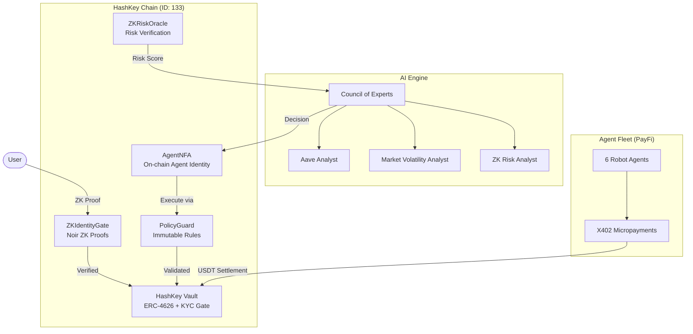
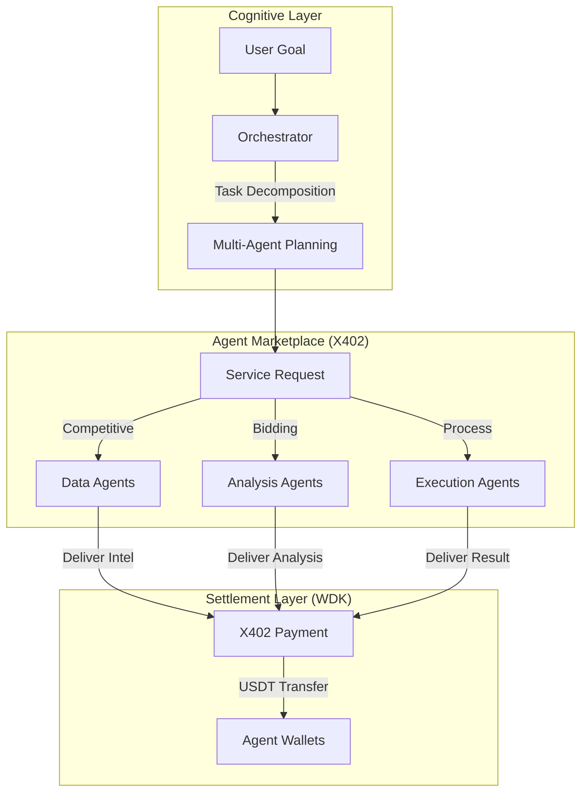
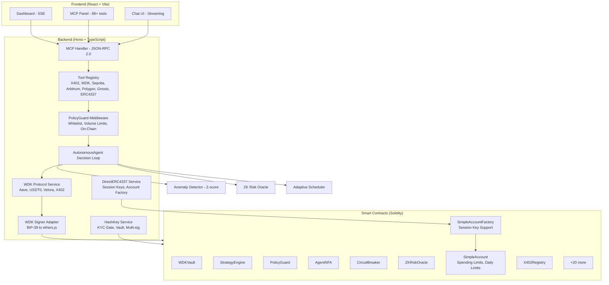
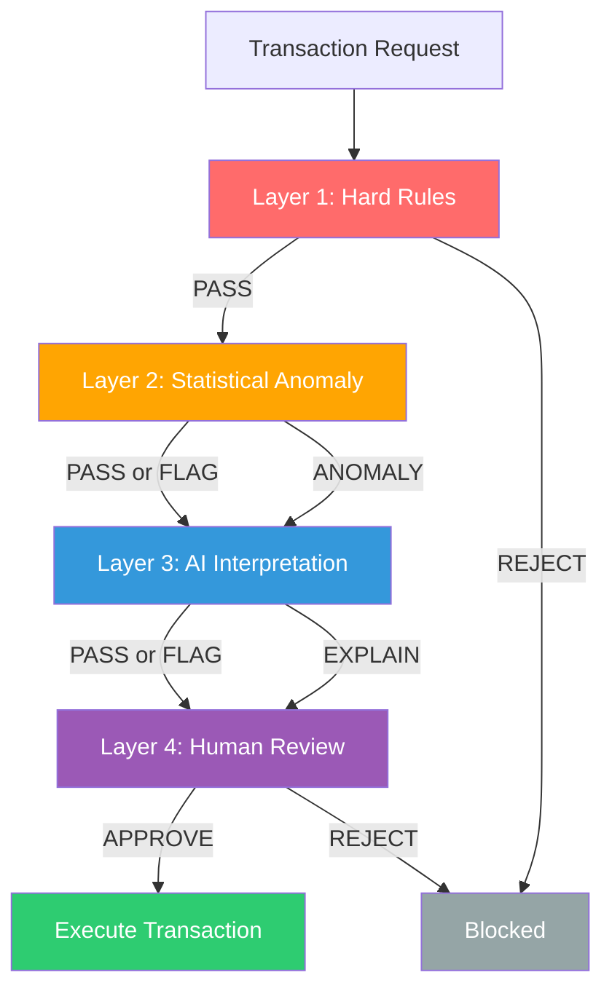
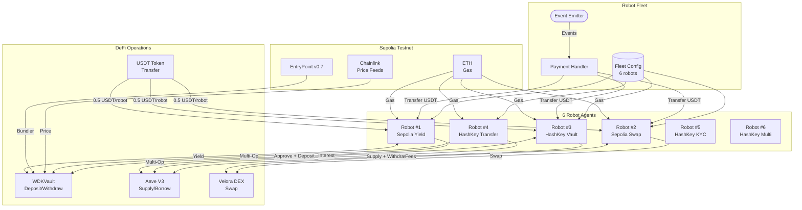
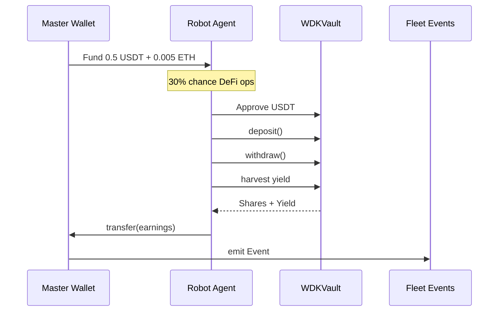
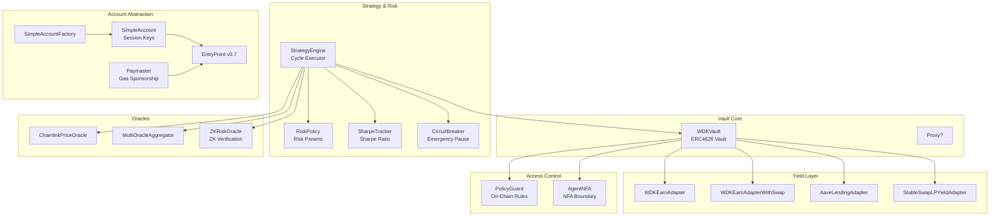
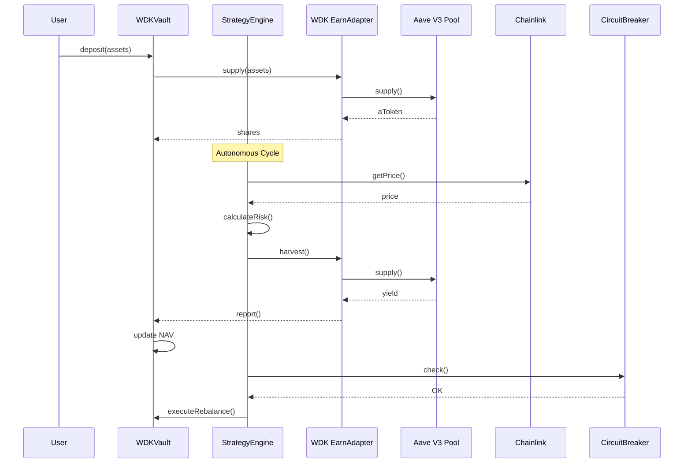

# OmniAgent — Compliant Autonomous DeFi on HashKey Chain

<div align="center">
  
</div>

<div align="center">

[](https://testnet-explorer.hsk.xyz)
[](#zk-identity-gate)
[](#ai-autonomous-agent)
[](https://opensource.org/licenses/Apache-2.0)

</div>

> ZK identity gating + AI yield agent + agent-to-agent payments — built on HashKey Chain.

---

## What It Does (30-second version)

1. **Users prove KYC eligibility via ZK proof** — Noir circuits verify age, jurisdiction, and KYC level without exposing personal data
2. **AI Council of Experts autonomously manages vault yield** — 3 specialist analysts vote, PolicyGuard enforces immutable on-chain rules
3. **Agent fleet coordinates via X402 micropayments** — robots hire each other for market intelligence, settle in USDT on HashKey Chain
4. **All execution constrained by on-chain governance** — 4-layer pipeline: hard rules → anomaly detection → AI → human review

---

## Architecture



## Live Demo

**Try it now:** https://omni-wdk.vercel.app/

**Deployed Contracts (HashKey Testnet):**

| Contract | Address | Purpose |
|----------|---------|---------|
| HashKey Vault | [`0x605b...7318`](https://testnet-explorer.hsk.xyz/address/0x605b6b8C83d8b0EA8867BEda4099DE4F042F7318) | KYC-gated ERC-4626 yield vault |
| ZKIdentityGate | [`0x82f3...843E`](https://testnet-explorer.hsk.xyz/address/0x82f3c7967Fe2A0ae8C9C3caCA79b8c5C1805843E) | ZK proof verification gate |
| ZKVerifier | [`0xBf90...8276`](https://testnet-explorer.hsk.xyz/address/0xBf90d38B9128FB70C91F0D1CB9908c5F5eE28276) | Groth16 proof verifier |
| AgentNFA | [`0xdFf5...5153A`](https://testnet-explorer.hsk.xyz/address/0xdFf5A296102818507313639E646C15cC53c5153A) | Non-fungible agent token |
| PolicyGuard | [`0x1E99...35fcD`](https://testnet-explorer.hsk.xyz/address/0x1E997a52FEd011C74d5a8579a74DEf1BaC035fcD) | On-chain policy enforcement |
| ZKRiskOracle | [`0x4aB2...57Ec7`](https://testnet-explorer.hsk.xyz/address/0x4aB2C183dAa811F5a2a26C3A3E6dF1d34F157Ec7) | ZK-verified risk decisions |

**Key Numbers:** 48 smart contracts | 92 MCP tools | 5 chains | 60+ tests | 6 robot agents

---

## Tether Integration

OmniAgent is built natively on **Tether's WDK** (Wallet Development Kit) and uses **Tether tokens** as the core asset for all operations:

| Token | Network | Address | Usage |
|-------|---------|---------|-------|
| **USDT** | Sepolia | [`0xd077a400968890eacc75cdc901f0356c943e4fdb`](https://sepolia.etherscan.io/address/0xd077a400968890eacc75cdc901f0356c943e4fdb) | Vault deposits, agent payments, X402 economy |
| **XAUt** | Sepolia | [`0x810249eF893D98ac8da4d6EB018E8CF7c16d536c`](https://sepolia.etherscan.io/address/0x810249eF893D98ac8da4d6EB018E8CF7c16d536c) | Gold-backed yield strategies |

**Key Tether features used:**
- **WDK Vault (Escrow + Yield)** — ERC-4626 compliant vault with escrow pattern; USDT earns Aave V3 yield during agent operations
- **WDK Engine** — Autonomous strategy execution with USDT/XAUT
- **X402 Agent Economy** — Peer-to-peer USDT micropayments between agents for intelligence services
- **Aave Integration** — USDT supply/borrow on Aave V3
- **Cross-chain Bridge** — USDT0 bridging to Arbitrum/Polygon
- **Multi-Chain Agency** — Native settlement on Sepolia with tools for Arbitrum, Polygon, Gnosis

---

## Agent Economy: A2A Marketplace

OmniAgent implements a **peer-to-peer Agent-to-Agent (A2A) marketplace** where AI agents autonomously hire, pay, and coordinate with each other:



**How agents pay each other:**
1. **Intelligence Requests** — Agent requests market data from specialized sub-agents
2. **Competitive Pricing** — Sub-agents quote prices via X402 protocol
3. **Payment Settlement** — USDT transfers directly between agent wallets
4. **Economic Ledger** — All transactions recorded on-chain for transparency

**Economic Mechanics:**
- **Reputation System** — Agents track service quality; high-reputation agents earn premium rates
- **Yield Accrual** — Idle USDT in escrow earns Aave V3 yield during operations
- **Cost Optimization** — Orchestrator selects best value providers automatically

---

## ZK Risk Verification

OmniAgent is the **first agent system with zero-knowledge risk verification**:

| Feature | Implementation |
|---------|----------------|
| **ZKRiskOracle** | On-chain ZK proofs verify risk decisions without exposing proprietary models |
| **Cryptographic Audit Trail** | Every risk decision is provably computed from authorized inputs |
| **Trustless Verification** | Counterparties verify risk claims without trusting the agent's internal logic |

This enables institutional-grade trust in autonomous agent operations.

---

## OpenClaw Agent Framework

OmniAgent integrates with **OpenClaw** — an open-source AI agent framework for autonomous reasoning:

| Class | File | Description |
|-------|------|-------------|
| **OpenClawClient** | `services/openclaw-client.ts` | Gateway client for agent orchestration |
| **OpenClawPolicyEnforcer** | `services/openclaw-policy.ts` | Financial policy enforcement |

### OpenClawClient Methods

| Method | Description |
|--------|-------------|
| `listAgents()` | List available agents in the network |
| `getToolsCatalog()` | Get catalog of available tools |
| `describeNode()` | Get node/agent information |
| `listSessions()` | List active sessions |
| `getCapabilities()` | Get framework capabilities |
| `invokeTool()` | Execute tools via OpenClaw |
| `chatCompletions()` | LLM chat interface |

### OpenClawPolicyEnforcer Rules

| Check | Logic |
|-------|-------|
| `checkTransaction()` | Size limits: <1 ETH allowed, >1 ETH blocked |
| `checkYieldOpportunity()` | Low risk requires ≥8.5% APY, high risk requires 1.5x multiplier |
| `checkExposure()` | Protocol exposure ≤20% of portfolio |
| `checkAgentOperation()` | Whitelist: swap, supply, withdraw, transfer, bridge, stake |

**Tests:** 16 tests covering all OpenClaw integration — run with `pnpm vitest run test/services/openclaw.test.ts`

---

## HashKey Chain Integration

OmniAgent is **multi-chain ready**, with HashKey testnet (chain 133) as the target:

| Contract | Address | Description |
|----------|---------|-------------|
| **HashKeyVault** | [`0x605b6b8C83d8b0EA8867BEda4099DE4F042F7318`](https://testnet-explorer.hsk.xyz/address/0x605b6b8C83d8b0EA8867BEda4099DE4F042F7318) | KYC-gated ERC-4626 vault (KYC L2+) — v2 |
| **MockKycSBT** | [`0x1525E262Cb5bDFC7b51802c36a1141bA94405F76`](https://testnet-explorer.hsk.xyz/address/0x1525E262Cb5bDFC7b51802c36a1141bA94405F76) | KYC SBT with 3-level verification |
| **MockUSDT** | [`0xA3eb6Cb28659ec53388FE5Ff3E64920e3C274038`](https://testnet-explorer.hsk.xyz/address/0xA3eb6Cb28659ec53388FE5Ff3E64920e3C274038) | Mock USDT (6 decimals) |
| **ZKIdentityGate** | [`0x82f3c7967Fe2A0ae8C9C3caCA79b8c5C1805843E`](https://testnet-explorer.hsk.xyz/address/0x82f3c7967Fe2A0ae8C9C3caCA79b8c5C1805843E) | ZK proof gate for vault deposits (Noir circuit) |
| **ZKVerifier** | [`0xBf90d38B9128FB70C91F0D1CB9908c5F5eE28276`](https://testnet-explorer.hsk.xyz/address/0xBf90d38B9128FB70C91F0D1CB9908c5F5eE28276) | Structure-validating ZK proof verifier |
| **AgentNFA** | [`0xdFf5A296102818507313639E646C15cC53c5153A`](https://testnet-explorer.hsk.xyz/address/0xdFf5A296102818507313639E646C15cC53c5153A) | NFT-based agent boundary (execute routes through PolicyGuard) |
| **PolicyGuard** | [`0x1E997a52FEd011C74d5a8579a74DEf1BaC035fcD`](https://testnet-explorer.hsk.xyz/address/0x1E997a52FEd011C74d5a8579a74DEf1BaC035fcD) | Emergency breaker, whitelist/blocked receivers, tx limits |

**KYC Levels:**
- Level 1 — Basic (verified humans only)
- Level 2 — Intermediate (enhanced verification)
- Level 3 — Advanced (full vault access + yield operations)

**Demo Flow:** Agent wallet (`0xA4c009f0541d9C7f86F12cF4470Faf60448B240B`) holds KYC Level 3, enabling vault deposit/withdraw and yield routing.

### Deploy to HashKey

```bash
cd backend
cp .env.example .env
# Set WDK_SECRET_SEED and OPENROUTER_API_KEY

# Deploy contracts (uses PRIVATE_KEY from .env or defaults to Hardhat account #1)
npx tsx scripts/deploy-hashkey-direct.ts

# Set KYC level 3 for agent wallet
npx hardhat run scripts/set-kyc-agent.ts --network hashkey
```

---

## Architecture



---

## Quick Start

### Prerequisites
- Node.js 18+
- pnpm 8+

### 1. Clone & Install

```bash
git clone https://github.com/your-repo/OmniAgent.git
cd OmniAgent

cd backend && pnpm install
cd ../frontend && pnpm install
```

### 2. Configure Environment

```bash
cd backend
cp .env.example .env
```

**Required variables:**

```bash
WDK_SECRET_SEED="your 12-24 word mnemonic"
OPENROUTER_API_KEY="your-openrouter-api-key"
SEPOLIA_RPC_URL="https://ethereum-sepolia.publicnode.com"
```

### 3. Start Development

```bash
# Terminal 1: Backend (includes MCP, SSE, Robot Fleet)
cd backend && pnpm run dev

# Terminal 2: Frontend
cd frontend && pnpm run dev
```

Open **http://localhost:5173** — Dashboard with MCP panel, chat, and autonomous loop controls.

### 4. Test MCP Endpoint

```bash
# List all 88+ tools
curl -X POST http://localhost:3001/api/mcp \
  -H "Content-Type: application/json" \
  -d '{"jsonrpc":"2.0","id":1,"method":"tools/list"}'

# Execute a tool
curl -X POST http://localhost:3001/api/mcp \
  -H "Content-Type: application/json" \
  -d '{"jsonrpc":"2.0","id":2,"method":"tools/call","params":{"name":"wdk_vault_getBalance","arguments":{}}}'
```

---

## MCP Tools (88+ Total)

### X402 Agent Economy (4 tools)
| Tool | Description | Risk |
|------|-------------|------|
| `x402_pay_subagent` | Pay USDT to sub-agent for intelligence | Medium |
| `x402_list_services` | List available AI sub-agents | Low |
| `x402_get_balance` | Get X402 wallet balance | Low |
| `x402_fleet_status` | Get robot fleet earnings status | Low |

### WDK Vault & Engine (12 tools)
| Tool | Description | Risk |
|------|-------------|------|
| `wdk_vault_deposit` | Deposit USDT into vault | Medium |
| `wdk_vault_withdraw` | Withdraw from vault | Medium |
| `wdk_vault_getBalance` | Get vault balance | Low |
| `wdk_vault_getState` | Get full vault state | Low |
| `wdk_engine_executeCycle` | Execute yield cycle | High |
| `wdk_engine_getRiskMetrics` | Get risk metrics | Low |
| `wdk_engine_getCycleState` | Get cycle state | Low |
| `wdk_aave_supply` | Supply to Aave via WDK | Medium |
| `wdk_aave_withdraw` | Withdraw from Aave | Medium |
| `wdk_aave_getPosition` | Get Aave position | Low |
| `wdk_bridge_usdt0_status` | Get bridge quote/status | Low |
| `wdk_mint_test_token` | Mint test USDT (testnet only) | Low |

### WDK Protocol Tools (9 tools)
| Tool | Description | Risk |
|------|-------------|------|
| `wdk_lending_supply` | Supply to Aave lending pool | Medium |
| `wdk_lending_withdraw` | Withdraw from Aave | Medium |
| `wdk_lending_borrow` | Borrow from Aave | High |
| `wdk_lending_repay` | Repay Aave debt | Medium |
| `wdk_lending_getPosition` | Get position & health factor | Low |
| `wdk_bridge_usdt0` | Bridge USDT across chains | Medium |
| `wdk_swap_tokens` | Swap via Velora | Medium |
| `wdk_autonomous_cycle` | Run autonomous yield cycle | High |
| `wdk_autonomous_status` | Get agent state | Low |

### Market Data — Bitfinex Pricing (1 tool)
| Tool | Description | Risk |
|------|-------------|------|
| `market_scan` | Scan market prices from Bitfinex (BTC/ETH/USDT/XAUT) | Low |

**Supported pairs:** BTC/USD, ETH/USD, USDT/USD, XAUT/USD
**Exchange fees:** 0.1% maker / 0.2% taker

### ERC-4337 Smart Accounts (17 tools)
| Tool | Description | Risk |
|------|-------------|------|
| `erc4337_createAccount` | Create smart account | Low |
| `erc4337_execute` | Execute single operation | Medium |
| `erc4337_executeBatch` | Execute batch operations | Medium |
| `erc4337_getAccountAddress` | Get predicted address | Low |
| `erc4337_getBalance` | Get account balance | Low |
| `erc4337_addDeposit` | Add ETH deposit | Medium |
| `erc4337_withdrawNative` | Withdraw ETH | Medium |
| `erc4337_withdrawToken` | Withdraw ERC20 | Medium |
| `erc4337_setTokenApproval` | Approve token spend | Medium |
| `erc4337_isTokenApproved` | Check approval status | Low |
| `erc4337_getDeposit` | Get deposit info | Low |
| `erc4337_isValidAccount` | Validate account | Low |
| `erc4337_createSessionKey` | Create new session key pair | Low |
| `erc4337_grantSessionKey` | Grant session key with limits | Medium |
| `erc4337_revokeSessionKey` | Revoke session key instantly | Medium |
| `erc4337_getSessionKeyData` | Get session key details | Low |
| `erc4337_executeWithSessionKey` | Execute via session key | Medium |

**Session Key Features:**
- Spending limits per transaction
- Daily spending limits with automatic reset
- Target address restrictions
- Expiration timestamps
- Instant revocation

### Multi-Chain Wallets (22+ tools)

| Chain | Tools | Description |
|-------|-------|-------------|
| **Sepolia** | 10 | `sepolia_createWallet`, `sepolia_getBalance`, `sepolia_transfer`, `sepolia_swap`, `sepolia_supplyAave`, `sepolia_withdrawAave`, `sepolia_bridgeLayerZero`, `sepolia_getCreditScore`, `sepolia_getNavInfo`, `sepolia_getTransactionHistory` |
| **Arbitrum** | 4 | `arbitrum_createWallet`, `arbitrum_getBalance`, `arbitrum_transfer`, `arbitrum_getGasPrice` |
| **Polygon** | 4 | `polygon_createWallet`, `polygon_getBalance`, `polygon_transfer`, `polygon_getGasPrice` |
| **Gnosis** | 4 | `gnosis_createWallet`, `gnosis_getBalance`, `gnosis_transfer`, `gnosis_getGasPrice` |
| **HashKey** | 10 | `hashkey_createWallet`, `hashkey_getBalance`, `hashkey_transfer`, `hashkey_checkKyc`, `hashkey_getVaultState`, `hashkey_vaultDeposit`, `hashkey_vaultWithdraw`, `hashkey_getNetworkInfo`, `hashkey_getSafeTxStatus`, `hashkey_executeSafeTx` |

---

## 4-Layer Governance Pipeline

Every transaction flows through 4 layers before execution:



---

## Robot Fleet Economy

OmniAgent includes a **Robot Fleet Simulator** — virtual sub-agents that demonstrate agent-to-agent economics:



**Fleet Lifecycle:**



---

## Smart Contracts Architecture



**Contract Interaction Flow:**



---

## Smart Contracts (30+ Deployed)

Core contracts deployed on Sepolia testnet:

| Contract | Address | Size | Description |
|----------|---------|------|-------------|
| **WDKVault** | [`0x739D6Bf14C4a37b67Ae000eAAb0AbdABd7C624Af`](https://sepolia.etherscan.io/address/0x739D6Bf14C4a37b67Ae000eAAb0AbdABd7C624Af) | 21.9 KB | Main vault for deposits, shares, NAV tracking |
| **StrategyEngine** | [`0x4A3e42E49b69ef0fD569bdc50354EaB444f36476`](https://sepolia.etherscan.io/address/0x4A3e42E49b69ef0fD569bdc50354EaB444f36476) | 19.5 KB | Yield strategy execution & rebalancing (uses Chainlink oracle) |
| **WDKEarnAdapterWithSwap** | [`0x52AfFd555f769d50907837DaFC8575C703150421`](https://sepolia.etherscan.io/address/0x52AfFd555f769d50907837DaFC8575C703150421) | 14.1 KB | Aave yield with auto-swap |
| **WDKEarnAdapter** | [`0xd2a701f702Da660A4e8D7613076cfd6065695349`](https://sepolia.etherscan.io/address/0xd2a701f702Da660A4e8D7613076cfd6065695349) | 10.6 KB | Standard Aave yield adapter |
| **ExecutionAuction** | [`0x3fe160021429d3dAa606791f3cf6323A57A5126a`](https://sepolia.etherscan.io/address/0x3fe160021429d3dAa606791f3cf6323A57A5126a) | 12 KB | Rebalance Rights Auction (MEV capture) |
| **PolicyGuard** | [`0xE4fFcace565701C231FAF0222e3963e3c5a50690`](https://sepolia.etherscan.io/address/0xE4fFcace565701C231FAF0222e3963e3c5a50690) | 9.6 KB | On-chain policy enforcement |
| **AgentNFA** | [`0xf66e0865cCd84652808a261f97609862f4BA8c4c`](https://sepolia.etherscan.io/address/0xf66e0865cCd84652808a261f97609862f4BA8c4c) | 8.9 KB | Agent boundary NFA |
| **CircuitBreaker** | [`0xf5B7bF143045B0e59E2D854726424A8C77CE2250`](https://sepolia.etherscan.io/address/0xf5B7bF143045B0e59E2D854726424A8C77CE2250) | 8.2 KB | Emergency pause |
| **SimpleAccountFactory** | [`0x738428DD7930EBB2f61763a18C805782A1A6586b`](https://sepolia.etherscan.io/address/0x738428DD7930EBB2f61763a18C805782A1A6586b) | 9 KB | ERC-4337 factory |
| **SharpeTracker** | [`0x85a6394b36B075825Af18030EB3c57Dfac157A0F`](https://sepolia.etherscan.io/address/0x85a6394b36B075825Af18030EB3c57Dfac157A0F) | 7.9 KB | Sharpe ratio tracking |
| **RiskPolicy** | [`0xCfd177b13e470B213B45D74Ae4d44C2FDFedDF50`](https://sepolia.etherscan.io/address/0xCfd177b13e470B213B45D74Ae4d44C2FDFedDF50) | 5.5 KB | Risk parameters |
| **X402Registry** | [`0xCaFf652ab8a3dAA826b4cBb3159f25aa41875960`](https://sepolia.etherscan.io/address/0xCaFf652ab8a3dAA826b4cBb3159f25aa41875960) | 4.2 KB | X402 payment ledger |
| **ZKRiskOracle** | [`0x01aCCB9ceADFe3dE6070e9859795A46e3B435CD1`](https://sepolia.etherscan.io/address/0x01aCCB9ceADFe3dE6070e9859795A46e3B435CD1) | 3.1 KB | ZK risk verification |
| **TWAPMultiOracle** | [`0x5e8c72Ea96aA69ABC1f33d6d8741F062AE08148D`](https://sepolia.etherscan.io/address/0x5e8c72Ea96aA69ABC1f33d6d8741F062AE08148D) | 5.1 KB | **Deprecated**: Flash-loan resistant oracle (30-min TWAP) - not used in current deployment |
| **MultiOracleAggregator** | [`0xc2810A869a35C1eC8A51b39f6bfCF951F186Ec5A`](https://sepolia.etherscan.io/address/0xc2810A869a35C1eC8A51b39f6bfCF951F186Ec5A) | 2.9 KB | Multi-source consensus |
| **GroupSyndicate** | [`0xaB94Eb8F6cab09B2B1989Ac02fbDcceC91A9cD8f`](https://sepolia.etherscan.io/address/0xaB94Eb8F6cab09B2B1989Ac02fbDcceC91A9cD8f) | 4.2 KB | Group syndicate |
| **LayerZeroBridgeReceiver** | [`0x0aec7c174554AF8aEc3680BB58431F6618311510`](https://sepolia.etherscan.io/address/0x0aec7c174554AF8aEc3680BB58431F6618311510) | 5.1 KB | Cross-chain bridge |

**External Dependencies (Sepolia):**
- **USDT** (Real Tether, 6 dec): [`0xd077a400968890eacc75cdc901f0356c943e4fdb`](https://sepolia.etherscan.io/address/0xd077a400968890eacc75cdc901f0356c943e4fdb)
- **XAUT** (Real Tether Gold, mintable, 6 dec): [`0x810249eF893D98ac8da4d6EB018E8CF7c16d536c`](https://sepolia.etherscan.io/address/0x810249eF893D98ac8da4d6EB018E8CF7c16d536c)
- **Aave V3 Pool**: [`0x6Ae43d3271ff6888e7Fc43Fd7321a503ff738951`](https://sepolia.etherscan.io/address/0x6Ae43d3271ff6888e7Fc43Fd7321a503ff738951)
- **Chainlink ETH/USD**: [`0x694AA1769357215DE4FAC081bf1f309aDC325306`](https://sepolia.etherscan.io/address/0x694AA1769357215DE4FAC081bf1f309aDC325306)
- **Chainlink BTC/USD**: [`0x1b44F3514812d835EB1BDB0acB33d3fA3351Ee43`](https://sepolia.etherscan.io/address/0x1b44F3514812d835EB1BDB0acB33d3fA3351Ee43)
- **ERC-4337 EntryPoint v0.7**: [`0x0000000071727De22E5E9d8BAf0edAc6f37da032`](https://sepolia.etherscan.io/address/0x0000000071727De22E5E9d8BAf0edAc6f37da032)

---

## Environment Variables Reference

### Required

| Variable | Description |
|----------|-------------|
| `WDK_SECRET_SEED` | BIP-39 mnemonic (12-24 words) for agent wallet |
| `OPENROUTER_API_KEY` | OpenRouter API key for LLM calls |
| `SEPOLIA_RPC_URL` | Sepolia RPC endpoint |
| `HASHKEY_RPC_URL` | HashKey testnet RPC (`https://testnet.hsk.xyz`) |
| `HASHKEY_VAULT_ADDRESS` | HashKey vault address |
| `HASHKEY_USDT_ADDRESS` | HashKey mock USDT address |
| `HASHKEY_KYC_SBT_ADDRESS` | HashKey KYC SBT address |

### Optional — LLM Models

| Variable | Default | Description |
|----------|---------|-------------|
| `OPENROUTER_MODEL_GENERAL` | `google/gemini-2.5-flash-lite` | General reasoning model |
| `OPENROUTER_MODEL_CRYPTO` | `x-ai/grok-4.1-fast` | Crypto-specialized model |

### Optional — OpenClaw Agent Framework

| Variable | Default | Description |
|----------|---------|-------------|
| `OPENCLAW_GATEWAY_URL` | `https://gateway.openclaw.com/api` | OpenClaw gateway endpoint |
| `OPENCLAW_API_KEY` | - | API key for OpenClaw (optional) |
| `MAX_OPENCLAW_EXPOSURE_PERCENT` | `20` | Max protocol exposure % for yield |
| `MIN_OPENCLAW_APY` | `8.5` | Min APY for high-risk yield |

### Optional — Robot Fleet

| Variable | Default | Description |
|----------|---------|-------------|
| `ROBOT_FLEET_ENABLED` | `false` | Enable robot fleet simulator |
| `ROBOT_FLEET_SIZE` | `6` | Number of virtual robots (2 Sepolia + 4 HashKey) |
| `ROBOT_FLEET_TASK_INTERVAL_MIN` | `3600000` | Min task interval (ms, default 1 hour) |
| `ROBOT_FLEET_TASK_INTERVAL_MAX` | `7200000` | Max task interval (ms, default 2 hours) |
| `ROBOT_FLEET_EARNINGS_MIN` | `0.1` | Min USDT earnings per task |
| `ROBOT_FLEET_EARNINGS_MAX` | `0.5` | Max USDT earnings per task |
| `ROBOT_FLEET_MIN_TRANSFER_THRESHOLD` | `2.0` | Min USDT threshold before transfer to master |
| `ROBOT_FLEET_USE_WDK_AGENTS` | `true` | Use WDK agent wallets for fleet |
| `ROBOT_FLEET_X402_ENABLED` | `true` | Enable X402 payments between robots |

### Optional — Deployment

| Variable | Default | Description |
|----------|---------|-------------|
| `DEPLOYMENT_MODE` | `local` | `local` enables agent; `production` disables |
| `ALLOW_AGENT_RUN` | `true` | Enable autonomous agent loop |

### Optional — Contract Addresses (auto-populated after deployment)

```bash
WDK_VAULT_ADDRESS=
WDK_ENGINE_ADDRESS=
WDK_USDT_ADDRESS=
WDK_BREAKER_ADDRESS=
WDK_ZK_ORACLE_ADDRESS=
WDK_POLICY_GUARD_ADDRESS=
WDK_AGENT_NFA_ADDRESS=
HASHKEY_VAULT_ADDRESS=     # HashKey testnet vault
HASHKEY_USDT_ADDRESS=      # HashKey testnet USDT
HASHKEY_KYC_SBT_ADDRESS=   # HashKey testnet KYC SBT
```

Full list: see `backend/.env.example`

---

## Project Structure

```
OmniAgent/
├── backend/
│   ├── contracts/                    # Solidity smart contracts
│   │   ├── WDKVault.sol             # 21.9KB - Main vault
│   │   ├── StrategyEngine.sol       # 19.5KB - Yield execution
│   │   ├── PolicyGuard.sol          # On-chain policy enforcement
│   │   ├── AgentNFA.sol             # Agent NFA boundary
│   │   ├── ZKRiskOracle.sol         # ZK risk verification
│   │   ├── mocks/                   # Mock contracts for testing
│   │   └── interfaces/              # Contract interfaces
│   ├── src/
│   │   ├── api/routes/
│   │   │   ├── mcp.ts               # JSON-RPC MCP endpoint
│   │   │   ├── chat.ts              # Streaming AI chat
│   │   │   ├── stats.ts             # Vault/risk stats
│   │   │   └── dashboard.ts         # SSE dashboard events
│   │   ├── agent/
│   │   │   ├── AutonomousLoop.ts    # Decision loop
│   │   │   ├── middleware/
│   │   │   │   └── PolicyGuard.ts   # Policy enforcement
│   │   │   └── services/
│   │   │       ├── AnomalyDetector.ts    # Z-score + IQR
│   │   │       ├── GovernancePipeline.ts # 4-layer pipeline
│   │   │       ├── AdaptiveScheduler.ts  # Dynamic polling
│   │   │       └── PaymentGate.ts        # X402 payments
│   │   ├── services/
│   │   │   ├── AutonomousAgent.ts   # Main agent service
│   │   │   ├── WdkProtocolService.ts # Aave/Bridge/Swap
│   │   │   ├── WdkSignerAdapter.ts  # WDK → ethers.js
│   │   │   ├── NavShield.ts         # NAV safety checks
│   │   │   ├── openclaw-client.ts   # OpenClaw agent framework client
│   │   │   └── openclaw-policy.ts  # OpenClaw policy enforcement
│   │   ├── mcp-server/
│   │   │   ├── tool-registry.ts     # Tool registration
│   │   │   └── handlers/            # 54+ tool implementations
│   │   │       ├── wdk-tools.ts
│   │   │       ├── wdk-protocol-tools.ts
│   │   │       ├── sepolia-tools.ts
│   │   │       ├── erc4337-tools.ts
│   │   │       ├── x402-tools.ts
│   │   │       ├── arbitrum-tools.ts
│   │   │       ├── polygon-tools.ts
│   │   │       └── gnosis-tools.ts
│   │   └── scripts/
│   │       └── robot-simulator.ts   # Robot fleet
│   ├── scripts/
│   │   ├── deploy.ts                # Unified deployment
│   │   ├── deploy-hashkey.ts        # HashKey testnet deployment
│   │   ├── set-kyc-agent.ts         # Set KYC level for agent wallet
│   │   └── inspect.ts               # Contract inspection
│   ├── test/
│   │   └── services/
│   │       └── openclaw.test.ts      # OpenClaw integration tests
│   ├── .env.example
│   └── package.json
├── frontend/
│   ├── src/
│   │   ├── App.tsx                  # Main app
│   │   ├── components/
│   │   │   ├── ai-elements/         # Reasoning UI
│   │   │   └── TestnetTools.tsx     # MCP panel
│   │   ├── hooks/                   # wagmi hooks
│   │   └── lib/                     # Config
│   └── package.json
└── README.md
```

---

## Scripts

```bash
# Backend
pnpm run dev              # Development server (MCP + SSE + Robot Fleet)
pnpm run build            # Production build
pnpm run start            # Production server
pnpm run compile          # Compile Solidity contracts
pnpm run test             # Run Hardhat tests
pnpm run test:smoke       # Run smoke tests
pnpm run robot:start      # Start robot fleet simulator
pnpm run robot:dev        # Robot fleet in watch mode

# Deployment
pnpm run deploy:full      # Full deployment (tokens + contracts + seed)
pnpm run deploy:zk-oracle # Deploy ZK Risk Oracle only
pnpm run deploy:seed      # Seed vault with test USDT
pnpm run deploy:whitelist # Whitelist contracts

# Inspection
pnpm run inspect:contracts # Check deployed contracts
pnpm run inspect:vault     # Check vault state
pnpm run inspect:smoke     # Run smoke inspection

# Frontend
pnpm run dev              # Development server
pnpm run build            # Production build

# E2E Testing
cd frontend && pnpm playwright test
cd frontend && pnpm playwright test --headed
```

---

## Deployment

### Local Hardhat

```bash
# Terminal 1: Start local node
cd backend && pnpm run node

# Terminal 2: Deploy and seed
pnpm run deploy:full
```

### Sepolia Testnet

```bash
# Set PRIVATE_KEY in .env, then:
pnpm run deploy:full
```

### HashKey Testnet

```bash
# Deploy HashKey-specific contracts
npx hardhat run scripts/deploy-hashkey.ts --network hashkey

# Set up agent KYC level
npx hardhat run scripts/set-kyc-agent.ts --network hashkey
```

After deployment, update `.env` with contract addresses printed by the script.

---

## Troubleshooting

### Empty Vault After Deployment

```bash
# Seed manually
pnpm run deploy:seed
```

### Stats Endpoint Error

```bash
# Redeploy ZK Oracle
pnpm run deploy:zk-oracle
```

### RPC Errors

Check `SEPOLIA_RPC_URL` in `.env`.

### HashKey Deployment Issues

```bash
# Verify contracts are deployed on HashKey testnet
# Check explorer: https://testnet-explorer.hsk.xyz

# Redeploy if needed
npx hardhat run scripts/deploy-hashkey.ts --network hashkey

# Set agent KYC after deployment
npx hardhat run scripts/set-kyc-agent.ts --network hashkey
```

---

## License

Apache 2.0 — See [LICENSE](LICENSE)

---

<div align="center">

**"Verified by math, not vibes."**

*Built on Tether WDK • Powered by X402 • Secured by ZK*

</div>
