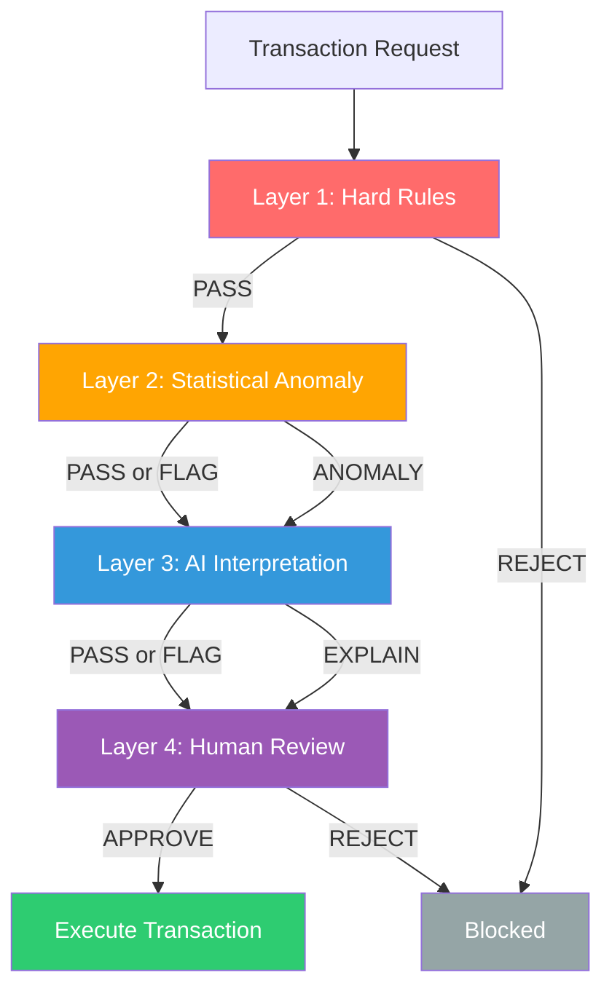

# OmniAgent — The ZK-Verified Autonomous Capital Allocator Fleet

<div align="center">
  
</div>

<div align="center">

[](https://opensource.org/licenses/Apache-2.0)
[](https://nodejs.org/)
[](https://www.typescriptlang.org/)
[](https://react.dev/)
[](https://soliditylang.org/)
[](https://docs.wdk.tether.io)
[](https://x402.org/)

</div>


OmniAgent is an autonomous, non-custodial yield routing stack. It introduces a new paradigm: an autonomous AI capital allocator managing a **fleet of robot sub-agents** that coordinate yield strategies, pay each other for market intelligence via X402 micropayments, and verify risk decisions with zero-knowledge proofs — all while maintaining on-chain policy enforcement.

---

## Architecture

```mermaid
graph TB
    subgraph Frontend["Frontend (React + Vite)"]
        Dashboard[Dashboard - SSE]
        MCPPanel[MCP Panel - 54+ tools]
        ChatUI[Chat UI - Streaming]
    end

    subgraph Backend["Backend (Hono + TypeScript)"]
        MCPHandler[MCP Handler - JSON-RPC 2.0]
        ToolRegistry[Tool Registry<br/>X402 | WDK | Sepolia | Arbitrum | Polygon | Gnosis | ERC4337]
        PolicyGuard[PolicyGuard Middleware<br/>Whitelist | Volume Limits | On-Chain]
        AutoAgent[AutonomousAgent Decision Loop]
        WDKService[WDK Protocol Service<br/>Aave | USDT0 | Velora | X402]
        WDKSigner[WDK Signer Adapter<br/>BIP-39 → ethers.js]
    end

    subgraph SmartContracts["Smart Contracts (Solidity)"]
        WDKVault[WDKVault]
        StrategyEngine[StrategyEngine]
        PolicyGuardSC[PolicyGuard]
        AgentNFA[AgentNFA]
        CircuitBreaker[CircuitBreaker]
        ZKRiskOracle[ZKRiskOracle]
        ERC4337[ERC4337]
        X402Registry[X402Registry]
        More[+20 more]
    end

    Dashboard --> MCPHandler
    MCPPanel --> MCPHandler
    ChatUI --> MCPHandler
    MCPHandler --> ToolRegistry
    ToolRegistry --> PolicyGuard
    PolicyGuard --> AutoAgent
    AutoAgent --> WDKService
    AutoAgent --> AnomalyDetector[Anomaly Detector - Z-score]
    AutoAgent --> ZKOracle[ZK Risk Oracle]
    AutoAgent --> AdaptiveScheduler[Adaptive Scheduler]
    WDKService --> WDKSigner
    WDKSigner --> SmartContracts
```

---

## Quick Start

### Prerequisites
- Node.js 18+
- pnpm 8+

### 1. Clone & Install

```bash
git clone https://github.com/your-repo/OmniAgent.git
cd OmniAgent

cd backend && pnpm install
cd ../frontend && pnpm install
```

### 2. Configure Environment

```bash
cd backend
cp .env.example .env
```

**Required variables:**

```bash
WDK_SECRET_SEED="your 12-24 word mnemonic"
OPENROUTER_API_KEY="your-openrouter-api-key"
SEPOLIA_RPC_URL="https://ethereum-sepolia.publicnode.com"
```

### 3. Start Development

```bash
# Terminal 1: Backend (includes MCP, SSE, Robot Fleet)
cd backend && pnpm run dev

# Terminal 2: Frontend
cd frontend && pnpm run dev
```

Open **http://localhost:5173** — Dashboard with MCP panel, chat, and autonomous loop controls.

### 4. Test MCP Endpoint

```bash
# List all 54+ tools
curl -X POST http://localhost:3001/api/mcp \
  -H "Content-Type: application/json" \
  -d '{"jsonrpc":"2.0","id":1,"method":"tools/list"}'

# Execute a tool
curl -X POST http://localhost:3001/api/mcp \
  -H "Content-Type: application/json" \
  -d '{"jsonrpc":"2.0","id":2,"method":"tools/call","params":{"name":"wdk_vault_getBalance","arguments":{}}}'
```

---

## MCP Tools (54+ Total)

### X402 Agent Economy (4 tools)
| Tool | Description | Risk |
|------|-------------|------|
| `x402_pay_subagent` | Pay USDT to sub-agent for intelligence | Medium |
| `x402_list_services` | List available AI sub-agents | Low |
| `x402_get_balance` | Get X402 wallet balance | Low |
| `x402_fleet_status` | Get robot fleet earnings status | Low |

### WDK Vault & Engine (13 tools)
| Tool | Description | Risk |
|------|-------------|------|
| `wdk_vault_deposit` | Deposit USDT into vault | Medium |
| `wdk_vault_withdraw` | Withdraw from vault | Medium |
| `wdk_vault_getBalance` | Get vault balance | Low |
| `wdk_vault_getState` | Get full vault state | Low |
| `wdk_engine_executeCycle` | Execute yield cycle | High |
| `wdk_engine_getRiskMetrics` | Get risk metrics | Low |
| `wdk_engine_getCycleState` | Get cycle state | Low |
| `wdk_aave_supply` | Supply to Aave via WDK | Medium |
| `wdk_aave_withdraw` | Withdraw from Aave | Medium |
| `wdk_aave_getPosition` | Get Aave position | Low |
| `wdk_bridge_usdt0` | Bridge USDT0 cross-chain | Medium |
| `wdk_bridge_usdt0_status` | Get bridge quote/status | Low |
| `wdk_mint_test_token` | Mint test USDT (testnet only) | Low |

### WDK Protocol Tools (9 tools)
| Tool | Description | Risk |
|------|-------------|------|
| `wdk_lending_supply` | Supply to Aave lending pool | Medium |
| `wdk_lending_withdraw` | Withdraw from Aave | Medium |
| `wdk_lending_borrow` | Borrow from Aave | High |
| `wdk_lending_repay` | Repay Aave debt | Medium |
| `wdk_lending_getPosition` | Get position & health factor | Low |
| `wdk_bridge_usdt0` | Bridge USDT across chains | Medium |
| `wdk_swap_tokens` | Swap via Velora | Medium |
| `wdk_autonomous_cycle` | Run autonomous yield cycle | High |
| `wdk_autonomous_status` | Get agent state | Low |

### ERC-4337 Smart Accounts (12 tools)
| Tool | Description | Risk |
|------|-------------|------|
| `erc4337_createAccount` | Create smart account | Low |
| `erc4337_execute` | Execute single operation | Medium |
| `erc4337_executeBatch` | Execute batch operations | Medium |
| `erc4337_getAccountAddress` | Get predicted address | Low |
| `erc4337_getBalance` | Get account balance | Low |
| `erc4337_addDeposit` | Add ETH deposit | Medium |
| `erc4337_withdrawNative` | Withdraw ETH | Medium |
| `erc4337_withdrawToken` | Withdraw ERC20 | Medium |
| `erc4337_setTokenApproval` | Approve token spend | Medium |
| `erc4337_isTokenApproved` | Check approval status | Low |
| `erc4337_getDeposit` | Get deposit info | Low |
| `erc4337_isValidAccount` | Validate account | Low |

### Multi-Chain Wallets (22 tools)

| Chain | Tools | Description |
|-------|-------|-------------|
| **Sepolia** | 10 | `sepolia_createWallet`, `sepolia_getBalance`, `sepolia_transfer`, `sepolia_swap`, `sepolia_supplyAave`, `sepolia_withdrawAave`, `sepolia_bridgeLayerZero`, `sepolia_getCreditScore`, `sepolia_getNavInfo`, `sepolia_getTransactionHistory` |
| **Arbitrum** | 4 | `arbitrum_createWallet`, `arbitrum_getBalance`, `arbitrum_transfer`, `arbitrum_getGasPrice` |
| **Polygon** | 4 | `polygon_createWallet`, `polygon_getBalance`, `polygon_transfer`, `polygon_getGasPrice` |
| **Gnosis** | 4 | `gnosis_createWallet`, `gnosis_getBalance`, `gnosis_transfer`, `gnosis_getGasPrice` |

---

## 4-Layer Governance Pipeline

Every transaction flows through 4 layers before execution:



---

## Smart Contracts (30+ Deployed)

Core contracts deployed on Sepolia testnet:

| Contract | Address | Size | Description |
|----------|---------|------|-------------|
| **WDKVault** | `0x739D6Bf14C4a37b67Ae000eAAb0AbdABd7C624Af` | 21.9 KB | Main vault for deposits, shares, NAV tracking |
| **StrategyEngine** | `0x387741487f10880F6Ae691678c59E26dAb9eBeff` | 19.5 KB | Yield strategy execution & rebalancing |
| **WDKEarnAdapterWithSwap** | `0x52AfFd555f769d50907837DaFC8575C703150421` | 14.1 KB | Aave yield with auto-swap |
| **WDKEarnAdapter** | `0xd2a701f702Da660A4e8D7613076cfd6065695349` | 10.6 KB | Standard Aave yield adapter |
| **ExecutionAuction** | TBD | 12 KB | Competitive execution via auctions |
| **PolicyGuard** | `0xE4fFcace565701C231FAF0222e3963e3c5a50690` | 9.6 KB | On-chain policy enforcement (B-scheme) |
| **AgentNFA** | `0xf66e0865cCd84652808a261f97609862f4BA8c4c` | 8.9 KB | Agent NFA with execute() boundary |
| **CircuitBreaker** | `0xf5B7bF143045B0e59E2D854726424A8C77CE2250` | 8.2 KB | Emergency pause mechanism |
| **ERC4337SmartAccount** | `0x58Cc6439B281d46f40979f8E7A47B24C7f0F09f4` | 9 KB | Account abstraction support |
| **SharpeTracker** | `0x85a6394b36B075825Af18030EB3c57Dfac157A0F` | 7.9 KB | Risk-adjusted return tracking |
| **RiskPolicy** | `0xCfd177b13e470B213B45D74Ae4d44C2FDFedDF50` | 5.5 KB | Risk parameter management |
| **X402Registry** | TBD | 4.2 KB | X402 service registry |
| **ZKRiskOracle** | `0x01aCCB9ceADFe3dE6070e9859795A46e3B435CD1` | 3.1 KB | Zero-knowledge risk verification |
| **TWAPMultiOracle** | TBD | 5.1 KB | Time-weighted price feeds |
| **MultiOracleAggregator** | TBD | 2.9 KB | Multi-oracle price aggregation |
| **GroupSyndicate** | TBD | 4.2 KB | Group syndicate management |
| **LayerZeroBridgeReceiver** | TBD | 5.1 KB | Cross-chain message receiver |

**External Dependencies (Sepolia):**
- **USDT** (Real Tether, 6 dec): `0xd077a400968890eacc75cdc901f0356c943e4fdb`
- **XAUT** (Real Tether Gold, mintable, 6 dec): `0x810249eF893D98ac8da4d6EB018E8CF7c16d536c`
- **Aave V3 Pool**: `0x6Ae43d3271ff6888e7Fc43Fd7321a503ff738951`
- **Chainlink ETH/USD**: `0x694AA1769357215DE4FAC081bf1f309aDC325306`
- **Chainlink BTC/USD**: `0x1b44F3514812d835EB1BDB0acB33d3fA3351Ee43`
- **ERC-4337 EntryPoint v0.7**: `0x0000000071727De22E5E9d8BAf0edAc6f37da032`

---

## Robot Fleet Economy

OmniAgent includes a **Robot Fleet Simulator** — virtual sub-agents that demonstrate agent-to-agent economics:

```bash
# Start robot fleet standalone
pnpm run robot:start

# Or enable in .env
ROBOT_FLEET_ENABLED=true
ROBOT_FLEET_SIZE=8
```

**How it works:**
1. Virtual robots perform yield operations
2. Robots pay each other via X402 for market intelligence
3. Earnings tracked per-robot in fleet status
4. Demonstrates real agent-to-agent economic coordination

---

## Environment Variables Reference

### Required

| Variable | Description |
|----------|-------------|
| `WDK_SECRET_SEED` | BIP-39 mnemonic (12-24 words) for agent wallet |
| `OPENROUTER_API_KEY` | OpenRouter API key for LLM calls |
| `SEPOLIA_RPC_URL` | Sepolia RPC endpoint |

### Optional — LLM Models

| Variable | Default | Description |
|----------|---------|-------------|
| `OPENROUTER_MODEL_GENERAL` | `google/gemini-2.5-flash-lite` | General reasoning model |
| `OPENROUTER_MODEL_CRYPTO` | `x-ai/grok-4.1-fast` | Crypto-specialized model |

### Optional — Robot Fleet

| Variable | Default | Description |
|----------|---------|-------------|
| `ROBOT_FLEET_ENABLED` | `false` | Enable robot fleet simulator |
| `ROBOT_FLEET_SIZE` | `8` | Number of virtual robots |
| `ROBOT_FLEET_TASK_INTERVAL_MIN` | `5000` | Min task interval (ms) |
| `ROBOT_FLEET_TASK_INTERVAL_MAX` | `15000` | Max task interval (ms) |

### Optional — Contract Addresses (auto-populated after deployment)

```bash
WDK_VAULT_ADDRESS=
WDK_ENGINE_ADDRESS=
WDK_USDT_ADDRESS=
WDK_BREAKER_ADDRESS=
WDK_ZK_ORACLE_ADDRESS=
WDK_POLICY_GUARD_ADDRESS=
WDK_AGENT_NFA_ADDRESS=
```

Full list: see `backend/.env.example`

---

## Project Structure

```
OmniAgent/
├── backend/
│   ├── contracts/                    # Solidity smart contracts
│   │   ├── WDKVault.sol             # 21.9KB - Main vault
│   │   ├── StrategyEngine.sol       # 19.5KB - Yield execution
│   │   ├── PolicyGuard.sol          # On-chain policy enforcement
│   │   ├── AgentNFA.sol             # Agent NFA boundary
│   │   ├── ZKRiskOracle.sol         # ZK risk verification
│   │   ├── mocks/                   # Mock contracts for testing
│   │   └── interfaces/              # Contract interfaces
│   ├── src/
│   │   ├── api/routes/
│   │   │   ├── mcp.ts               # JSON-RPC MCP endpoint
│   │   │   ├── chat.ts              # Streaming AI chat
│   │   │   ├── stats.ts             # Vault/risk stats
│   │   │   └── dashboard.ts         # SSE dashboard events
│   │   ├── agent/
│   │   │   ├── AutonomousLoop.ts    # Decision loop
│   │   │   ├── middleware/
│   │   │   │   └── PolicyGuard.ts   # Policy enforcement
│   │   │   └── services/
│   │   │       ├── AnomalyDetector.ts    # Z-score + IQR
│   │   │       ├── GovernancePipeline.ts # 4-layer pipeline
│   │   │       ├── AdaptiveScheduler.ts  # Dynamic polling
│   │   │       └── PaymentGate.ts        # X402 payments
│   │   ├── services/
│   │   │   ├── AutonomousAgent.ts   # Main agent service
│   │   │   ├── WdkProtocolService.ts # Aave/Bridge/Swap
│   │   │   ├── WdkSignerAdapter.ts  # WDK → ethers.js
│   │   │   └── NavShield.ts         # NAV safety checks
│   │   ├── mcp-server/
│   │   │   ├── tool-registry.ts     # Tool registration
│   │   │   └── handlers/            # 54+ tool implementations
│   │   │       ├── wdk-tools.ts
│   │   │       ├── wdk-protocol-tools.ts
│   │   │       ├── sepolia-tools.ts
│   │   │       ├── erc4337-tools.ts
│   │   │       ├── x402-tools.ts
│   │   │       ├── arbitrum-tools.ts
│   │   │       ├── polygon-tools.ts
│   │   │       └── gnosis-tools.ts
│   │   └── scripts/
│   │       └── robot-simulator.ts   # Robot fleet
│   ├── scripts/
│   │   ├── deploy.ts                # Unified deployment
│   │   └── inspect.ts               # Contract inspection
│   ├── .env.example
│   └── package.json
├── frontend/
│   ├── src/
│   │   ├── App.tsx                  # Main app
│   │   ├── components/
│   │   │   ├── ai-elements/         # Reasoning UI
│   │   │   └── TestnetTools.tsx     # MCP panel
│   │   ├── hooks/                   # wagmi hooks
│   │   └── lib/                     # Config
│   └── package.json
└── README.md
```

---

## Scripts

```bash
# Backend
pnpm run dev              # Development server (MCP + SSE + Robot Fleet)
pnpm run build            # Production build
pnpm run start            # Production server
pnpm run compile          # Compile Solidity contracts
pnpm run test             # Run Hardhat tests
pnpm run test:smoke       # Run smoke tests
pnpm run robot:start      # Start robot fleet simulator
pnpm run robot:dev        # Robot fleet in watch mode

# Deployment
pnpm run deploy:full      # Full deployment (tokens + contracts + seed)
pnpm run deploy:zk-oracle # Deploy ZK Risk Oracle only
pnpm run deploy:seed      # Seed vault with test USDT
pnpm run deploy:whitelist # Whitelist contracts

# Inspection
pnpm run inspect:contracts # Check deployed contracts
pnpm run inspect:vault     # Check vault state
pnpm run inspect:smoke     # Run smoke inspection

# Frontend
pnpm run dev              # Development server
pnpm run build            # Production build

# E2E Testing
cd frontend && pnpm playwright test
cd frontend && pnpm playwright test --headed
```

---

## Deployment

### Local Hardhat

```bash
# Terminal 1: Start local node
cd backend && pnpm run node

# Terminal 2: Deploy and seed
pnpm run deploy:full
```

### Sepolia Testnet

```bash
# Set PRIVATE_KEY in .env, then:
pnpm run deploy:full
```

After deployment, update `.env` with contract addresses printed by the script.

---

## Troubleshooting

### Empty Vault After Deployment

```bash
# Seed manually
pnpm run deploy:seed
```

### Stats Endpoint Error

```bash
# Redeploy ZK Oracle
pnpm run deploy:zk-oracle
```

### RPC Errors

Check `SEPOLIA_RPC_URL` in `.env`.

---

## License

Apache 2.0 — See [LICENSE](LICENSE)

---

**OmniAgent: Where robots manage robots' money — verified by math, not vibes.**
