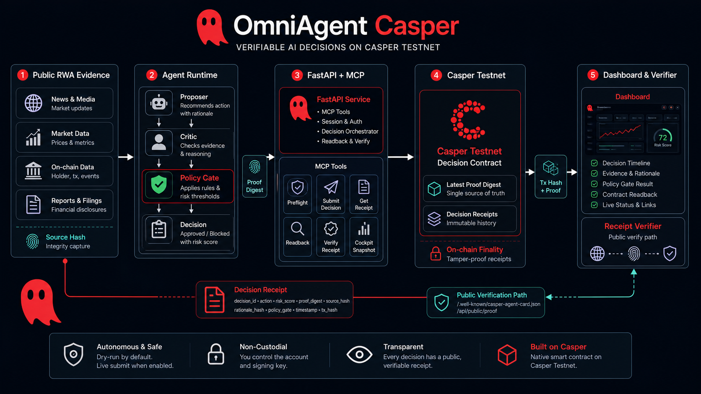

<p align="center">
  <a href="https://dorahacks.io/hackathon/casper-agentic-buildathon-finals/detail">
    
  </a>
</p>

<p align="center">
  <a href="frontend/public/imgs/omniagent-mascot.png"></a>
  <a href="https://dorahacks.io/hackathon/casper-agentic-buildathon-finals/detail"></a>
  <a href="contracts/casper-decision-proof"></a>
  <a href="https://testnet.cspr.live/contract/5270823ca6fb8c4cf5c1f83af53e889ec1f39bbd3532c2088175bb40ca97fc18"></a>
</p>

# OmniAgent Casper

OmniAgent is an AI risk desk for **tokenized collateral on Casper Testnet**.

It answers one practical question:

> After fresh public market evidence, should this collateral still be financeable — or should we haircut or freeze it?

A chatty score is not enough for credit desks. OmniAgent leaves a trail anyone can replay: evidence → agent reasoning → policy gate → Casper receipt → vault action → public proof. No private keys required to verify.

Built for the [Casper Agentic Buildathon Finals](https://dorahacks.io/hackathon/casper-agentic-buildathon-finals/detail).

---

## Try it in about five minutes

1. **Walk the desk story** — [omniyield.app/try#desk-story](https://omniyield.app/try#desk-story)  
   Unpaid evidence (402) → haircut → on-chain enforce → reject that cannot enforce → ACL cheat.
2. **Open the public proof** — [omniyield.app/api/public/proof](https://omniyield.app/api/public/proof)  
   You should see `status=live_verified` and a `deskStory` (no secrets).
3. **Spot-check the hard parts**  
   - Only OmniAgent can author receipts (`authoring.mode=agent_acl`)  
   - There is a blocked receipt (`authoring.lastBlocked`)  
   - The vault live-reads the decision contract (`vault.verificationMode=cross_contract`)  
   - Cheat Lab shows **6/6** intentional reverts  
   - Trust rates are non-zero (`verifiedReadbackRate`, `policyBlockedRate`)  
   - Lifecycle is live (`decisionLifecycle.status=live`)
4. **Probe unpaid evidence** — [omniyield.app/api/x402/rwa-evidence](https://omniyield.app/api/x402/rwa-evidence) → HTTP **402**
5. **Click explorer links** from the proof table for the latest decision, vault, and Cheat Lab deploys

Or paste this one-liner (also published as `verifier.oneCommand`):

```bash
curl -fsS https://api.omniyield.app/api/public/proof | python3 -c "import sys,json; p=json.load(sys.stdin); assert p.get('status')=='live_verified'; assert (p.get('authoring') or {}).get('lastBlocked'); assert (p.get('trustSummary') or {}).get('verifiedReadbackRate',0)>0; assert (p.get('trustSummary') or {}).get('policyBlockedRate',0)>0; print('ok', p.get('decisionId'), p.get('deployHash'))"
```

More for judges: [`docs/dorahacks-finals-description.md`](docs/dorahacks-finals-description.md) · [`docs/judge-reproduction.md`](docs/judge-reproduction.md) · [demo video](https://youtu.be/wcVoqJXqPhc)

---

## What’s live today

Last checked: **2026-07-26**. Both apps run on Railway in Southeast Asia.

| What | Where |
|------|--------|
| Proof console | [omniyield.app](https://omniyield.app) |
| Try / Cheat Lab | [omniyield.app/try](https://omniyield.app/try) |
| API | [api.omniyield.app](https://api.omniyield.app) |
| Public proof JSON | [api.omniyield.app/api/public/proof](https://api.omniyield.app/api/public/proof) |
| Agent card | [omniyield.app/.well-known/casper-agent-card.json](https://omniyield.app/.well-known/casper-agent-card.json) |
| Paid evidence (x402) | [api.omniyield.app/api/x402/rwa-evidence](https://api.omniyield.app/api/x402/rwa-evidence) |

**What that proof should show**

| Claim | Meaning |
|-------|---------|
| Authoring ACL | Only OmniAgent can call `record_decision` (User 130 / 131) |
| Vault mode | `cross_contract` — vault reads the decision package before freeze / LTV |
| Cheat Lab | 6/6 canaries (vault + ACL) |
| Paid-act lab | 3/3 buy → verify → act on `/try` |
| Decision lifecycle | Blocked receipt → approved haircut → cross-contract enforce |
| Trust summary | Measured rates over distinct decisions (not raw ledger spam) |
| Risk verdict | Sealed offer settled over x402 (1,000,000 WCSPR unit) |

Evidence paywall settles on Casper Testnet through CSPR.cloud’s x402 facilitator (Wrapped CSPR). Receipts and readback stay on Casper.



---

## How it works (plain English)

1. Pull public RWA evidence and hash it.
2. Run a small agent loop: **propose → critique → policy gate**.
3. If the gate approves, write a receipt on Casper (native Rust contract).
4. Optionally enforce on a collateral vault: freeze, unfreeze, or set LTV.
5. Publish a public proof page anyone can open without operator access.

| Piece | Role |
|-------|------|
| Backend | FastAPI + `casper_*` MCP tools |
| Decision contract | [casper-decision-proof](contracts/casper-decision-proof) — receipts + ACL |
| Vault contract | [collateral-vault](contracts/collateral-vault) — freeze / LTV |
| Frontend | Proof cockpit; proxies `/api/*` and `/.well-known/*` to the API |

### Vault enforcement

After a verified readback, policy maps to vault actions:

- `block` → freeze  
- `approve` → unfreeze  
- `haircut` → set LTV  

The safe path is `enforce_verified`: the vault **reads the live receipt from the decision package**. You cannot pass a fake receipt to invent freeze/LTV state.

```bash
CASPER_VAULT_ENFORCE_ENABLED=true
CASPER_VAULT_VERIFIED_ENABLED=true
CASPER_VAULT_ASSET_ID=rwa-demo-collateral-001
# plus verified contract + package hashes
```

Helpers: [`scripts/install-collateral-vault.sh`](scripts/install-collateral-vault.sh) · [`scripts/build-casper-contracts.sh`](scripts/build-casper-contracts.sh)

### Who can write decisions (ACL)

Only the installed agent account may call `record_decision`. Wrong signer → User **130**. Mismatched `agent_account_hash` → User **131**. Upgrade helper: [`scripts/upgrade-decision-proof-acl.sh`](scripts/upgrade-decision-proof-acl.sh).

### Cheat Lab

On [`/try`](https://omniyield.app/try), judges can click attacks that **should** fail:

- Vault: User 100 / 102 / 103 / 104  
- ACL: User 130 / 131 (canary-only — live OmniAgent *is* the authorized signer)  
- x402: unpaid 402 → settle → enforce from paid evidence  

Canaries: [`proofs/cheat-lab-canaries.json`](proofs/cheat-lab-canaries.json). The same page also tracks lifecycle, role reasons, trust rates, reject film, one-command verify, and the paid risk verdict — all driven by live public proof, not hardcoded marketing copy.

---

## Safety: dry run vs live chain

Live Casper submit is **off by default** locally. The public UI is read-only. Spending CSPR needs an authenticated operator path and explicit arms.

The live loop only writes when something materially new appears, and still respects:

- intent lock + on-chain replay check  
- cooldown and daily count/budget caps  
- a minimum CSPR reserve  

```bash
cd backend
CASPER_AGENT_LOOP_ENABLED=true \
CASPER_AGENT_LOOP_INTERVAL_SEC=3600 \
CASPER_AGENT_LOOP_DRY_RUN=true \
uv run uvicorn app.main:app --host 127.0.0.1 --port 8000
```

Evidence comes from the public US Treasury 10-Year series. If that feed is down, the loop **fails closed** — it does not invent a static rate.

**Live submit needs** a funded Testnet account, a signer outside git, deployed contract hashes, `casper-client`, `CASPER_LIVE_SUBMIT_ENABLED=true`, an operator token, a persistent ledger volume, and (for the recurring loop) `CASPER_AGENT_LOOP_LIVE_SUBMIT_ENABLED=true`. Full checklist lives in [`docs/judge-reproduction.md`](docs/judge-reproduction.md).

---

## Run it locally

```bash
# install
uv sync --project backend --group dev
corepack enable
pnpm -C frontend install --frozen-lockfile
cp backend/.env.example backend/.env
cp frontend/.env.example frontend/.env

# backend (safe — no live submit)
cd backend
OMNIAGENT_SKIP_ENV_FILE=true \
API_OPERATOR_TOKEN=judge-local-operator \
CASPER_LIVE_SUBMIT_ENABLED=false \
CASPER_AGENT_LOOP_ENABLED=false \
CASPER_AGENT_LOOP_DRY_RUN=true \
CASPER_AGENT_LOOP_LIVE_SUBMIT_ENABLED=false \
uv run uvicorn app.main:app --host 127.0.0.1 --port 8000

# frontend (another terminal)
VITE_API_URL=http://127.0.0.1:8000 pnpm -C frontend run dev
```

Open [http://localhost:5173](http://localhost:5173).

Release gate (no Testnet spend by default):

```bash
scripts/verify-casper-buildathon-stack.sh   # expect: [casper] ok
```

---

## Stack we actually use

We only claim what the code and live proof support:

| Item | Status |
|------|--------|
| Native Casper Rust (`casper-contract` / `casper-types`) | Yes |
| Local `casper_*` MCP tools | Yes |
| React/Vite frontend | Yes |
| FastAPI + `casper-client` | Yes |
| x402 paid evidence (verified + bound) | Yes on the public deploy |
| Odra | No — native Rust |
| CSPR.cloud | Optional balance/block probes |
| CSPR.click / CSPR.trade | Not claimed |

---

## Public proof fields worth knowing

| Field | Why it matters |
|-------|----------------|
| `evidenceGraph` | Sources, freshness, digest |
| `policyTemplate` | Deterministic policy id + hash |
| `trustSummary` | Per-decision rates (readback, blocked, stale, paid) |
| `decisionLifecycle` | Blocked → approved → enforce with explorer links |
| `riskVerdict` | Paid sealed offer (price, currency, settle tx) |
| `llmTrace.roles[]` | Reason codes + hashes (not raw prompts) |
| `deskStory.rejectVideoUrl` | Reject cut of the walkthrough |
| `verifier.oneCommand` | Copy-paste live assert |

**Trust sampling:** we count **decisions**, not every ledger row. Submit + later readback for the same `decisionId` count once; readback is OR-joined across that decision’s rows. Retry spam is not appended. Optional blocked canaries are labeled when seeded.

---

## Useful env vars (short list)

| Variable | Purpose |
|----------|---------|
| `CASPER_DECISION_CONTRACT_HASH` / `_PACKAGE_HASH` | Live decision contract |
| `CASPER_DECISION_AUTHORIZED_AGENT_HASH` | Who may author receipts |
| `CASPER_VAULT_VERIFIED_*` + `CASPER_VAULT_VERIFIED_ENABLED` | Cross-contract enforce |
| `CASPER_LIVE_SUBMIT_ENABLED` | Allow live deploys |
| `CASPER_AGENT_LOOP_LIVE_SUBMIT_ENABLED` | Allow the loop to spend |
| `CASPER_DECISION_LEDGER_PATH` | Persistent SQLite (mount a volume in prod) |
| `CASPER_LEDGER_MAX_EVENTS` | Retention (default 2000) |
| `API_OPERATOR_TOKEN` / `API_SESSION_SECRET` | Operator auth |
| `API_TRUSTED_HOSTS` | Must include `api.omniyield.app` |
| `CASPER_X402_EVIDENCE_URL` / `CASPER_X402_RECEIPT` | Paid evidence (don’t fake) |
| `CASPER_LLM_TRACE_ENABLED` + `OPENROUTER_API_KEY` | Public-safe role traces |
| `CASPER_DEMO_REJECT_VIDEO_URL` | Optional reject-only film |

Full table and ops notes: [`backend/.env.example`](backend/.env.example) · [`docs/finals-ops-runbook.md`](docs/finals-ops-runbook.md)

---

## Contracts & explorer pins

Live `/api/public/proof` is the source of truth. Treat explorer links as current only when they appear in a fresh proof with verified readback.

| Item | Link |
|------|------|
| Explorer | [testnet.cspr.live](https://testnet.cspr.live/) |
| Decision contract (ACL) | [5270823c…](https://testnet.cspr.live/contract/5270823ca6fb8c4cf5c1f83af53e889ec1f39bbd3532c2088175bb40ca97fc18) |
| Decision package | [46cf5754…](https://testnet.cspr.live/contract-package/46cf57541f04df822b160dd0e47a8425ec94c310e54a6dda862c46f9b4930bea) |
| Verified vault v3 | [d286dfb5…](https://testnet.cspr.live/contract/d286dfb5a15f935ee02c415e478fa08e2b4b2d8c35232002028904ba0f39c5b3) |
| Cross-contract haircut | [599dc698…](https://testnet.cspr.live/deploy/599dc698b0d7c52bd3d0ef86f819a47459100cf289b36db5f3fada0fe4354b1b) |

Build Wasm (MVP + size gate):

```bash
./scripts/build-casper-contracts.sh
```

Contract READMEs: [decision-proof](contracts/casper-decision-proof/README.md) · [vault](contracts/collateral-vault/README.md)  
Docs index: [docs/README.md](docs/README.md)
