# OmniAgent — System Architecture Blueprint

> **Scope**: BSC mainnet autonomous trading agent for BNB Hack Track 1.
> **Generated from**: Source code inspection (not speculative). All claims cite `file:line`.

**Related**: [problem-and-approach.md](./problem-and-approach.md) — design rationale and safety decisions | [CONTRIBUTING.md](./CONTRIBUTING.md) — local setup and contribution guide

---

## Table of Contents

1. [System Context (C4 Level 1)](#1-system-context)
2. [Container Diagram (C4 Level 2)](#2-container-diagram)
3. [Component Diagram — Backend (C4 Level 3)](#3-component-diagram--backend)
4. [Autonomous Trading Cycle — Sequence](#4-autonomous-trading-cycle)
5. [MCP Tool Call — Sequence](#5-mcp-tool-call)
6. [Trade Execution — Sequence](#6-trade-execution)
7. [Dashboard Polling — Sequence](#7-dashboard-polling)
8. [Strategy Decision Flow](#8-strategy-decision-flow)
9. [Trade Work Order — State Machine](#9-trade-work-order-fsm)
10. [Risk Policy — Decision Gates](#10-risk-policy-gates)
11. [Live Preflight — 9-Check Readiness](#11-live-preflight)
12. [Proof Score — 8-Point Verification](#12-proof-score)
13. [Data Model — Ledger Events](#13-data-model)
14. [Service Dependency Graph](#14-service-dependency-graph)
15. [Deployment Architecture](#15-deployment-architecture)
16. [Architecture Decision Records](#16-architecture-decision-records)

---

## 1. System Context

Who interacts with OmniAgent and what external systems does it depend on.

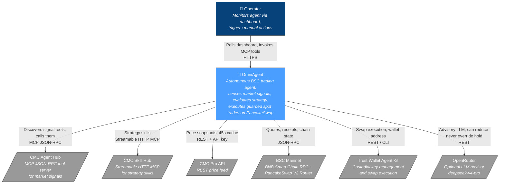

> **Source**: External URLs from [`backend/app/core/settings.py:62-98`](https://github.com/anhquan075/OmniAgent/blob/main/backend/app/core/settings.py#L62-L98)

---

## 2. Container Diagram

Three deployable containers plus their communication patterns.

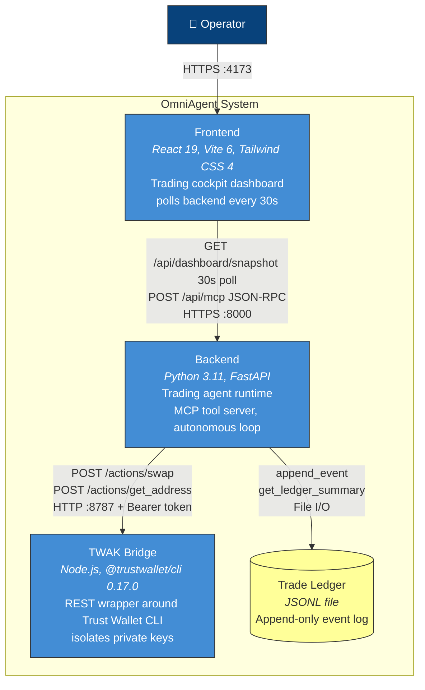

> **Source**: [`backend/app/main.py:22-46`](https://github.com/anhquan075/OmniAgent/blob/main/backend/app/main.py#L22-L46), [`frontend/`](https://github.com/anhquan075/OmniAgent/tree/main/frontend) poll interval in dashboard component, [`twak-bridge/`](https://github.com/anhquan075/OmniAgent/tree/main/twak-bridge) REST surface

---

## 3. Component Diagram — Backend

Internal service architecture within the FastAPI backend.

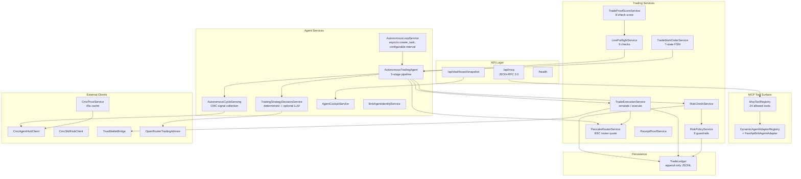

> **Source**: [`backend/app/services/container.py:28-56`](https://github.com/anhquan075/OmniAgent/blob/main/backend/app/services/container.py#L28-L56) (23 service classes in frozen dataclass DI)

---

## 4. Autonomous Trading Cycle

The core 5-stage pipeline executed by `AutonomousTradingAgent.run_autonomous_cycle()`.

Each stage is a hard gate: if SENSE returns no CMC signal, the cycle stops before STRATEGY runs. If RISK rejects, SIGN never executes.

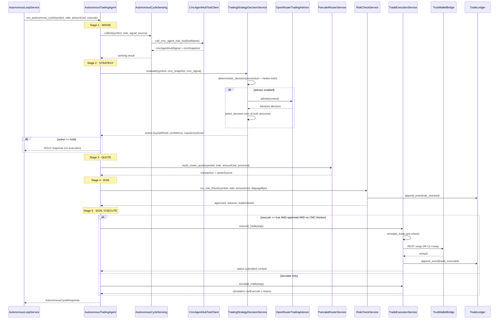

> **Source**: [`backend/app/services/agent/autonomous_cycle.py:15-172`](https://github.com/anhquan075/OmniAgent/blob/main/backend/app/services/agent/autonomous_cycle.py#L15-L172)

---

## 5. MCP Tool Call

How the frontend (or any client) invokes an agent capability through the MCP JSON-RPC surface.

The allowlist check at the registry layer means only the 24 configured tools can be called — any other tool name returns a -32601 error before reaching a service.

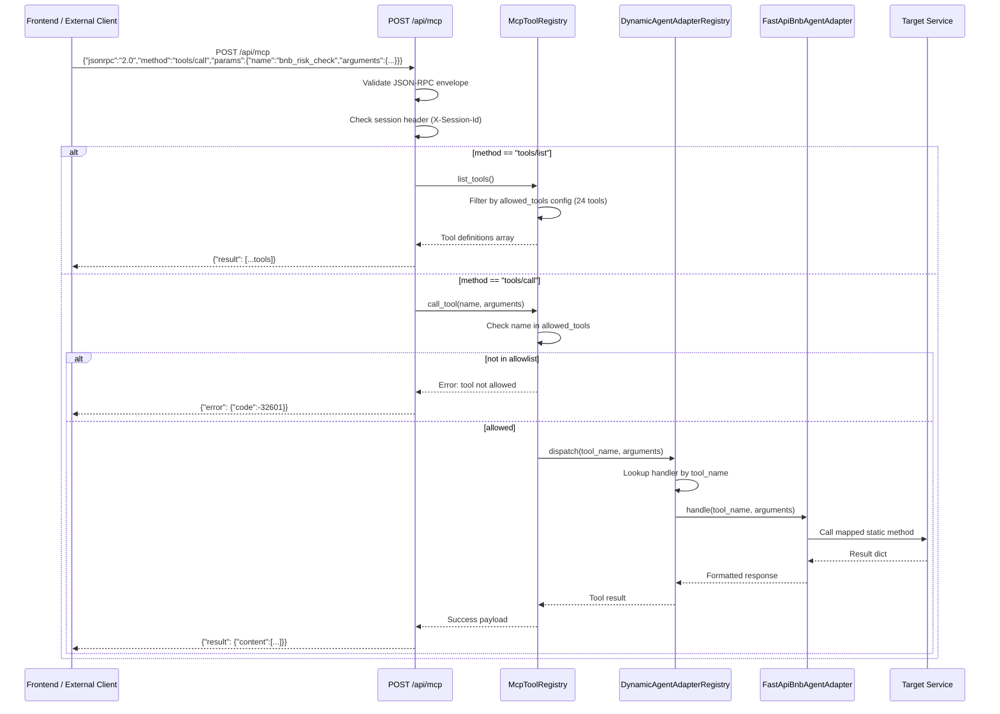

> **Source**: [`backend/app/api/routes/mcp.py:21-56`](https://github.com/anhquan075/OmniAgent/blob/main/backend/app/api/routes/mcp.py#L21-L56), [`backend/app/services/mcp/tools.py`](https://github.com/anhquan075/OmniAgent/blob/main/backend/app/services/mcp/tools.py)

---

## 6. Trade Execution

Detailed sequence within `TradeExecutionService.execute_trade()` — from simulation pre-check through TWAK dispatch to receipt confirmation.

Notice the 11-check simulation pre-check that runs before any TWAK call: if any blocker is present, the trade is logged as blocked and the function returns without touching the wallet.

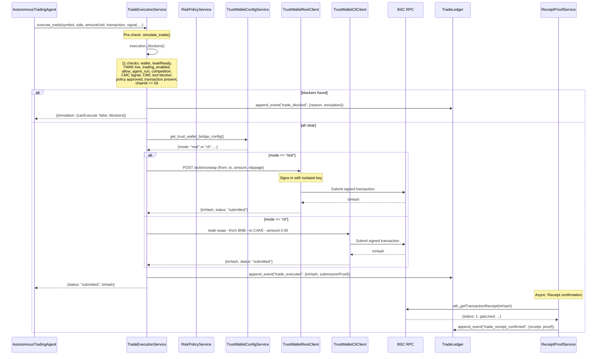

> **Source**: [`backend/app/services/trading/execution.py`](https://github.com/anhquan075/OmniAgent/blob/main/backend/app/services/trading/execution.py)

---

## 7. Dashboard Polling

How the frontend cockpit maintains near-real-time state.

The four parallel data fetches (preflight, ledger, proof score, work order) run concurrently on every poll, so the dashboard always shows a consistent snapshot of the agent's current state.

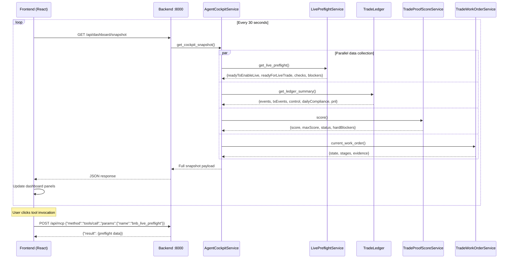

> **Source**: [`frontend/src/components/dashboard/BnbTradingAgentDashboard.tsx`](https://github.com/anhquan075/OmniAgent/tree/main/frontend/src/components/dashboard), [`backend/app/api/routes/dashboard.py`](https://github.com/anhquan075/OmniAgent/blob/main/backend/app/api/routes/dashboard.py)

---

## 8. Strategy Decision Flow

How the agent decides whether to trade, hold, or reduce position size.

The key constraint: if the deterministic engine returns hold, the LLM is never consulted. If both engines approve, the final position size is the minimum of the two amounts, never the larger.

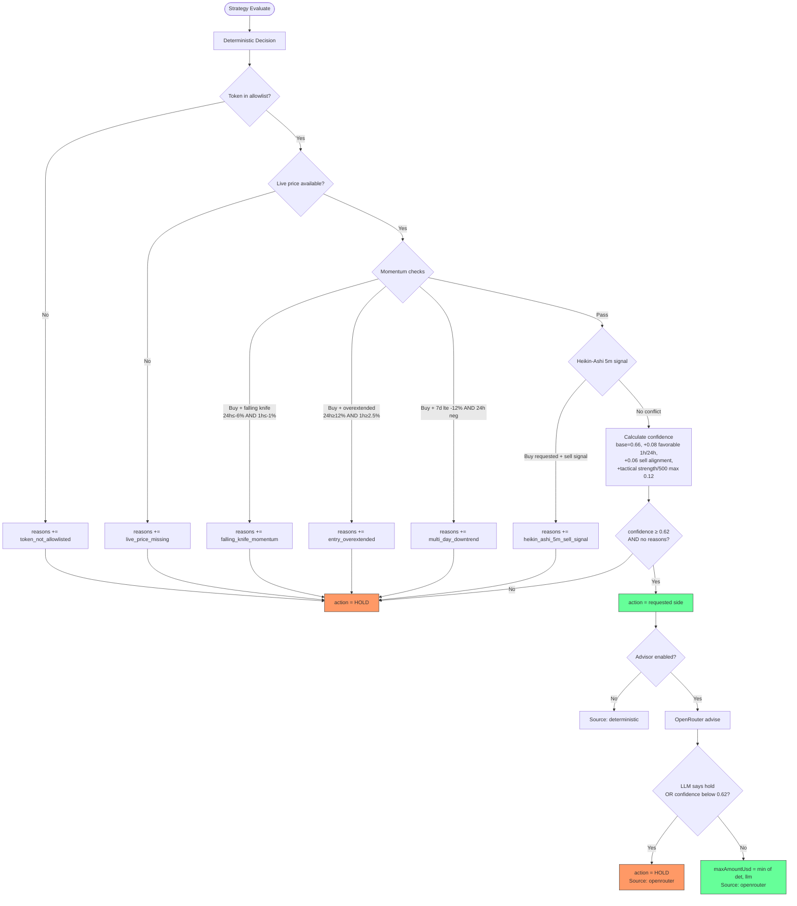

> **Key rule**: The LLM advisor can only **reduce** position size or **override to hold**. It can NEVER escalate from hold to trade.
>
> **Source**: [`backend/app/services/agent/strategy_decision.py:58-157`](https://github.com/anhquan075/OmniAgent/blob/main/backend/app/services/agent/strategy_decision.py#L58-L157)

---

## 9. Trade Work Order FSM

Every trade intent progresses through a 7-state finite state machine.

The FSM creates an audit trail: every state transition is logged to the append-only ledger, so the full history of a trade intent is recoverable even if the process crashes mid-cycle.

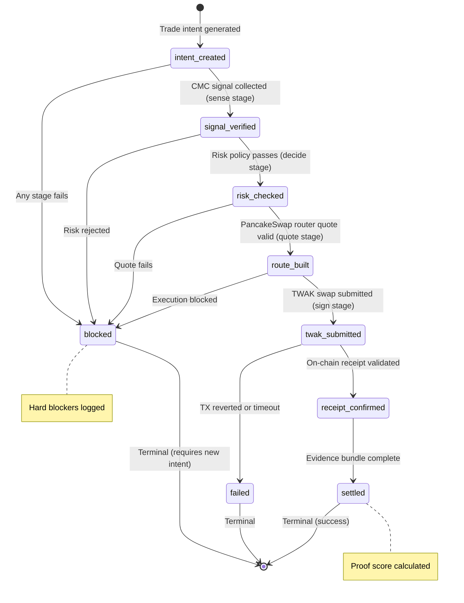

**States** (from `trade_work_order.py:9-17`):

| State | Description | Terminal? |
|---|---|---|
| `intent_created` | Trade intent generated with UUID | No |
| `signal_verified` | CMC Agent Hub signal collected and validated | No |
| `risk_checked` | All risk policy guardrails passed | No |
| `route_built` | PancakeSwap V2 Router returned valid quote with tx data | No |
| `twak_submitted` | Swap submitted to TWAK (REST or CLI) | No |
| `receipt_confirmed` | On-chain receipt proof validated | Yes |
| `settled` | Full evidence bundle assembled | Yes |
| `blocked` | Hard blocker encountered at any stage | Yes |
| `failed` | TX reverted or TWAK error | Yes |
| `paused` | Emergency pause activated | Yes |

> **Source**: [`backend/app/services/trading/trade_work_order.py:4-17`](https://github.com/anhquan075/OmniAgent/blob/main/backend/app/services/trading/trade_work_order.py#L4-L17)

---

## 10. Risk Policy Gates

Eight guardrail checks that MUST all pass before any trade is approved.

The system fails closed: a missing signal source, an exceeded drawdown limit, or an active emergency pause all produce the same result, rejection with a logged reason.

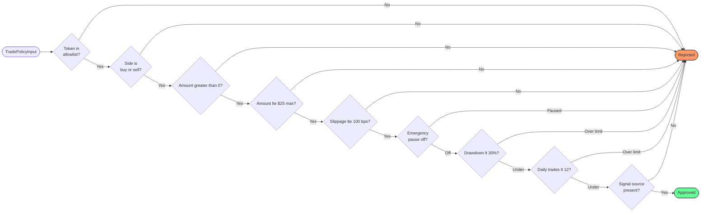

**Configurable limits** (from `settings.py:55-58`):

| Parameter | Default | Env Var |
|---|---|---|
| Max trade USD | $25 | `BNB_MAX_TRADE_USD` |
| Max slippage | 100 bps (1%) | `BNB_MAX_SLIPPAGE_BPS` |
| Max drawdown | 30% | `BNB_MAX_DRAWDOWN_PCT` |
| Max daily trades | 12 | `BNB_MAX_DAILY_TRADES` |
| Token allowlist | BNB, USDT, USDC, CAKE, TWT | `BNB_TOKEN_ALLOWLIST` |

> **Source**: [`backend/app/services/trading/policy.py:16-64`](https://github.com/anhquan075/OmniAgent/blob/main/backend/app/services/trading/policy.py#L16-L64)

---

## 11. Live Preflight

9 readiness checks that must pass before `BNB_TRADING_ENABLED=true` can be safely set.

The two-tier design separates configuration readiness (8 checks) from live execution readiness (flags + funded route). You can confirm the system is correctly configured before ever enabling live trading.

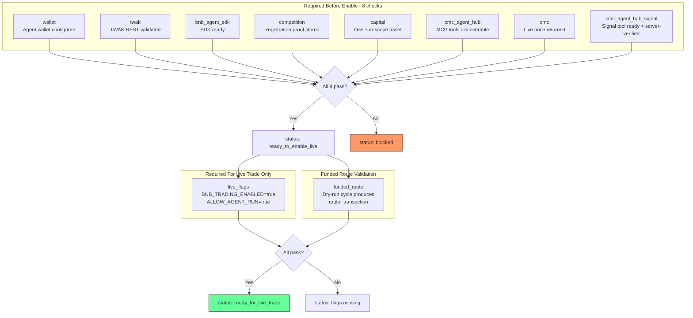

> **Source**: [`backend/app/services/trading/live_preflight.py:100-128`](https://github.com/anhquan075/OmniAgent/blob/main/backend/app/services/trading/live_preflight.py#L100-L128)

---

## 12. Proof Score

8-point verification score measuring trade evidence completeness.

The score is explanatory, not a gate. Hard blockers (preflight failures, receipt failures, emergency pause) block execution regardless of the numeric score.

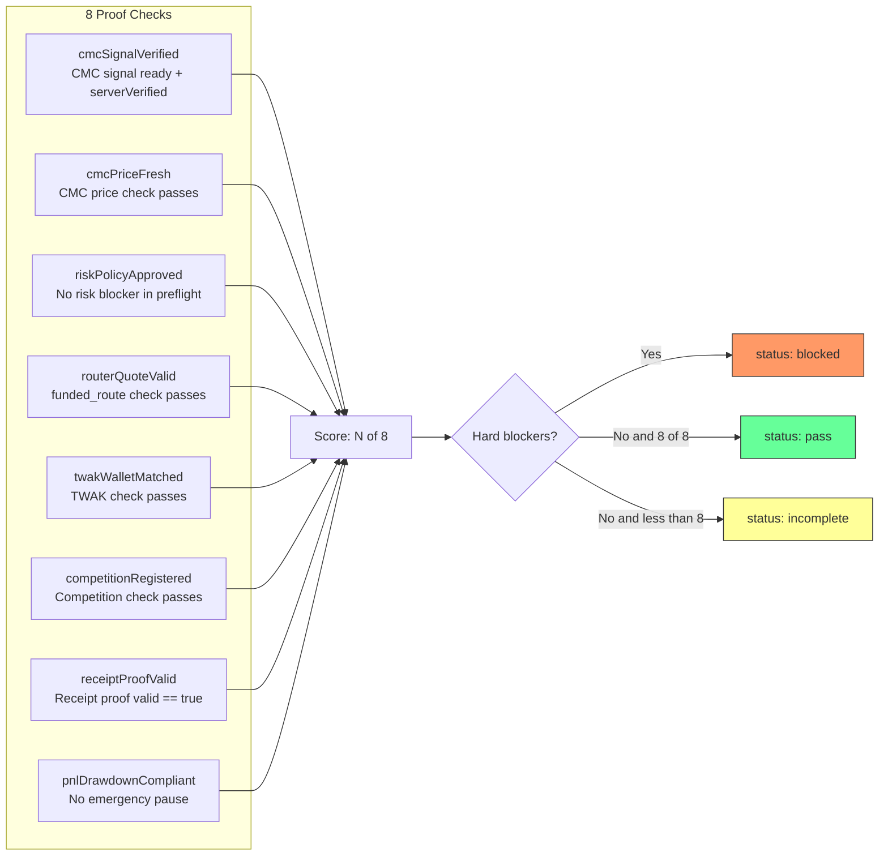

> **Note**: Score is explanatory only. Hard blockers (preflight failures, receipt failures, emergency pause) override the score.
>
> **Source**: [`backend/app/services/trading/proof_score.py:5-48`](https://github.com/anhquan075/OmniAgent/blob/main/backend/app/services/trading/proof_score.py#L5-L48)

---

## 13. Data Model

The ledger is the system's memory: every event — trade attempts, blocks, receipts, pauses — is appended with a `tradeIntentId` that links related events across the full lifecycle of a trade.

### Trade Ledger Event Schema

The append-only JSONL ledger at `backend/data/trade-ledger.jsonl` stores all trading events.

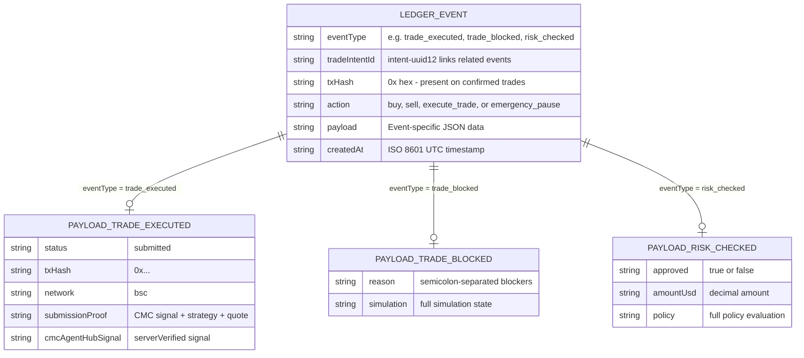

### Ledger Summary Derived Views

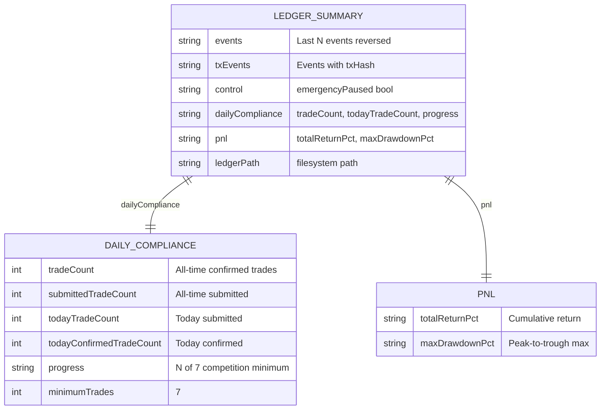

> **Source**: [`backend/app/services/shared/ledger.py:28-70`](https://github.com/anhquan075/OmniAgent/blob/main/backend/app/services/shared/ledger.py#L28-L70)

---

## 14. Service Dependency Graph

How the 23 services in `ServiceContainer` relate to each other at runtime.

The graph shows that `AutonomousTradingAgent` is the only service that touches both the strategy layer and the execution layer, all other services have a single responsibility.

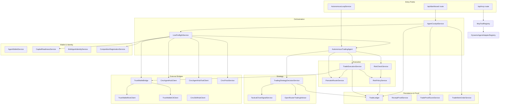

> **Source**: Import graph from [`backend/app/services/container.py:4-24`](https://github.com/anhquan075/OmniAgent/blob/main/backend/app/services/container.py#L4-L24)

---

## 15. Deployment Architecture

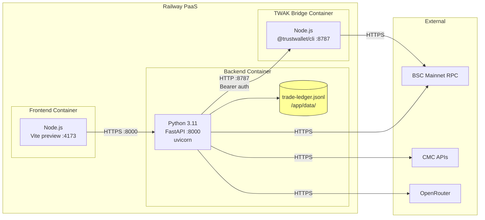

**Container Configuration**:

| Container | Port | Restart Policy | Source |
|---|---|---|---|
| backend | 8000 | ON_FAILURE, max 10 | `backend/railway.json` |
| frontend | 4173 | ON_FAILURE, max 10 | `frontend/railway.json` |
| twak-bridge | 8787 | ON_FAILURE, max 10 | `twak-bridge/railway.json` |

---

## 16. Architecture Decision Records

### ADR-1: Python over Node.js for Backend

| | |
|---|---|
| **Status** | Accepted |
| **Context** | BNB Hack requires the `bnbagent` Python SDK (≥0.3.4) for ERC-8004 agent identity registration. The official competition tooling is Python-first. |
| **Decision** | Use Python 3.11 + FastAPI as the backend runtime. |
| **Consequence** | Native SDK integration; async-first with `asyncio`; type-safety via Pydantic. TWAK (Node.js only) must be isolated in a separate container. |
| **Evidence** | [`backend/requirements.txt`](https://github.com/anhquan075/OmniAgent/blob/main/backend/requirements.txt): `bnbagent>=0.3.4` |

---

### ADR-2: Frozen Dataclass Service Container (DI)

| | |
|---|---|
| **Status** | Accepted |
| **Context** | Need dependency injection without heavyweight frameworks. All services are stateless (static methods only). |
| **Decision** | Use `@dataclass(frozen=True)` holding `Type[...]` references. Services are never instantiated — all methods are `@staticmethod`. |
| **Consequence** | Zero runtime overhead; immutable after construction; trivially testable by swapping class references. No dependency injection library needed. |
| **Trade-off** | Cannot use instance state — all state must flow through function arguments or module-level caches (`lru_cache` for Settings). |
| **Evidence** | [`backend/app/services/container.py:28-56`](https://github.com/anhquan075/OmniAgent/blob/main/backend/app/services/container.py#L28-L56) |

---

### ADR-3: Protocol-Based Contracts (Structural Typing)

| | |
|---|---|
| **Status** | Accepted |
| **Context** | Need service interfaces without requiring inheritance hierarchies. Python's duck typing is implicit — we want explicit contracts. |
| **Decision** | Define `Protocol` classes in `services/contracts.py` for service boundaries (LedgerService, PriceService, ToolRegistryService, WalletBridgeService, TradingAgentService). |
| **Consequence** | Any class with matching static methods satisfies the Protocol. No base class coupling. Static type checkers enforce compliance. |
| **Evidence** | [`backend/app/services/contracts.py:1-32`](https://github.com/anhquan075/OmniAgent/blob/main/backend/app/services/contracts.py#L1-L32) |

---

### ADR-4: MCP Tool Surface as Primary API Pattern

| | |
|---|---|
| **Status** | Accepted |
| **Context** | BNB Hack competition evaluates agents via MCP (Model Context Protocol) tool calls. The frontend also needs to invoke agent capabilities. |
| **Decision** | Expose all agent capabilities as MCP tools via JSON-RPC 2.0 at `POST /api/mcp`. Use `tools/list` and `tools/call` methods. Maintain a configurable allowlist. |
| **Consequence** | Single unified interface for both competition evaluation and frontend UI. Tool allowlist prevents unauthorized access. Each tool maps to a service handler via `DynamicAgentAdapterRegistry`. |
| **Trade-off** | All operations go through JSON-RPC overhead. No streaming support (poll-based dashboard instead). |
| **Evidence** | [`backend/app/api/routes/mcp.py:21-56`](https://github.com/anhquan075/OmniAgent/blob/main/backend/app/api/routes/mcp.py#L21-L56), [`backend/app/core/settings.py:29-39`](https://github.com/anhquan075/OmniAgent/blob/main/backend/app/core/settings.py#L29-L39) (24 tools in allowlist) |

---

### ADR-5: Append-Only JSONL Ledger (No Database)

| | |
|---|---|
| **Status** | Accepted |
| **Context** | Need an immutable audit trail. Competition requires proof of trades. Low write volume (~12 trades/day max). |
| **Decision** | Use append-only JSONL file at `backend/data/trade-ledger.jsonl`. Events are written with `json.dumps() + "\n"`. Reads scan full file. |
| **Consequence** | Zero database dependencies; trivially portable; audit-friendly (git-diffable). Scan-based reads are acceptable at ≤100 events/day. |
| **Trade-off** | No indexing, no concurrent write safety (single-process only), linear read time. Would not scale past ~10K events. |
| **Evidence** | [`backend/app/services/shared/ledger.py:117-123`](https://github.com/anhquan075/OmniAgent/blob/main/backend/app/services/shared/ledger.py#L117-L123) |

---

### ADR-6: TWAK Bridge Isolation (Key Separation)

| | |
|---|---|
| **Status** | Accepted |
| **Context** | Private keys must never exist in the FastAPI process memory. Trust Wallet CLI is a Node.js package. |
| **Decision** | Run TWAK as a separate Node.js container (`twak-bridge/`) with Bearer token auth. Backend communicates via REST only. |
| **Consequence** | Private keys confined to TWAK container. Backend crash cannot leak keys. Network-level isolation possible (internal-only port). |
| **Trade-off** | Extra container; REST overhead for every swap; requires HMAC auth management. |
| **Evidence** | [`backend/app/services/trading/execution.py:76-82`](https://github.com/anhquan075/OmniAgent/blob/main/backend/app/services/trading/execution.py#L76-L82) (REST vs CLI mode routing) |

---

### ADR-7: Proof-First Trade Lifecycle (Legwork-Inspired)

| | |
|---|---|
| **Status** | Accepted |
| **Context** | Competition requires demonstrable evidence of each trade's legitimacy (CMC signal → risk check → quote → execution → receipt). |
| **Decision** | Structure every trade as a Work Order FSM (7 states) with an 8-point Proof Score. Every stage produces auditable evidence. Blocked trades are also recorded. |
| **Consequence** | Complete audit trail from intent to settlement. Proof bundles can be submitted to competition verifiers. Dashboard shows real-time work order progress. |
| **Evidence** | [`backend/app/services/trading/trade_work_order.py:9-17`](https://github.com/anhquan075/OmniAgent/blob/main/backend/app/services/trading/trade_work_order.py#L9-L17), [`proof_score.py:5-14`](https://github.com/anhquan075/OmniAgent/blob/main/backend/app/services/trading/proof_score.py#L5-L14) |

---

### ADR-8: Deterministic Strategy + Advisory LLM (Never Override Hold)

| | |
|---|---|
| **Status** | Accepted |
| **Context** | Need predictable, auditable trading decisions. LLM hallucinations must not cause reckless trades. |
| **Decision** | Primary strategy is deterministic (CMC momentum + Heikin-Ashi 5m signals with fixed thresholds). Optional OpenRouter LLM advisor can only REDUCE position size or HOLD — it can NEVER escalate from hold to trade. |
| **Consequence** | Worst case for LLM failure = missed trade (hold). Never an unintended execution. Deterministic path is always auditable against fixed rules. |
| **Key rule**: `select_decision()` — if deterministic says HOLD, LLM is not consulted. If LLM says HOLD, final answer is HOLD. If both say trade, take `min(det.amount, llm.amount)`. |
| **Evidence** | [`backend/app/services/agent/strategy_decision.py:138-157`](https://github.com/anhquan075/OmniAgent/blob/main/backend/app/services/agent/strategy_decision.py#L138-L157) |

---

### ADR-9: Frontend Polling (No WebSocket)

| | |
|---|---|
| **Status** | Accepted |
| **Context** | Dashboard needs live-ish data. Trading cycle runs every 5 minutes (configurable). |
| **Decision** | Frontend polls `GET /api/dashboard/snapshot` every 30 seconds. Tool invocations use `POST /api/mcp` request-response. |
| **Consequence** | Simple deployment (no WebSocket upgrade handling). 30s staleness acceptable for 5-minute cycles. No connection management complexity. |
| **Trade-off** | Cannot show sub-second live updates. Wastes bandwidth when nothing changes. |

---

## Appendix: Configuration Reference

Full settings hierarchy from `backend/app/core/settings.py`:

| Group | Key | Default | Purpose |
|---|---|---|---|
| **Server** | `PORT` | 8000 | FastAPI listen port |
| | `OMNIAGENT_LOG_JSON` | true | Emit Loguru logs as JSON lines |
| | `OMNIAGENT_LOG_LEVEL` | INFO | Backend log level |
| **Trading** | `bnb_trading_enabled` | false | Master kill switch |
| | `allow_agent_run` | false | Secondary gate |
| | `bnb_max_trade_usd` | 25.0 | Per-trade cap |
| | `bnb_max_slippage_bps` | 100 | Max slippage (1%) |
| | `bnb_max_drawdown_pct` | 30.0 | Portfolio drawdown cap |
| | `bnb_max_daily_trades` | 12 | Daily trade limit |
| | `bnb_token_allowlist` | BNB,USDT,USDC,CAKE,TWT | Tradeable tokens |
| **Strategy** | `bnb_strategy_min_confidence` | 0.62 | Min confidence threshold |
| | `bnb_strategy_max_position_pct` | 0.35 | Max position size |
| | `bnb_strategy_advisor_enabled` | true | Enable LLM advisor |
| | `bnb_strategy_require_llm_for_live` | false | Require LLM for live trades |
| **Loop** | `bnb_autonomous_loop_enabled` | false | Enable autonomous loop |
| | `bnb_autonomous_loop_execute` | false | Live execution in loop |
| | `bnb_autonomous_loop_interval_sec` | 300 | Cycle interval (5 min) |
| | `bnb_autonomous_loop_initial_delay_sec` | 5 | Delay before the first automatic cycle after startup |
| | `bnb_autonomous_loop_symbol` | CAKE | Default trading symbol |
| **Chain** | `bnb_chain_id` | 56 | BSC mainnet |
| | `bnb_rpc_url` | bsc-dataseed.bnbchain.org | RPC endpoint |
| | `bnb_pancake_swap_router_address` | 0x10ED...024E | PancakeSwap V2 |
| **TWAK** | `trust_wallet_agent_kit_mode` | disabled | disabled/rest/cli |
| **CMC** | `cmc_mcp_url` | mcp.coinmarketcap.com/mcp | Agent Hub endpoint |
| | `cmc_skill_hub_mcp_url` | .../skill-hub/stream | Skill Hub endpoint |
| **LLM** | `openrouter_model` | deepseek/deepseek-v4-pro | Advisory model |

---

## Appendix: MCP Tool Surface (24 Tools)

From [`settings.py:29-39`](https://github.com/anhquan075/OmniAgent/blob/main/backend/app/core/settings.py#L29-L39) allowlist:

| Tool | Service Handler | Category |
|---|---|---|
| `bnb_agent_cockpit_snapshot` | AgentCockpitService | Dashboard |
| `bnb_get_wallet` | AgentWalletService | Wallet |
| `bnb_trust_wallet_status` | TrustWalletBridge | Wallet |
| `bnb_agent_sdk_status` | BnbAgentStatusService | Identity |
| `bnb_agent_sdk_register_identity` | BnbAgentIdentityService | Identity |
| `bnb_paid_resource_status` | X402PaymentService | Payment |
| `bnb_record_paid_signal_access` | X402PaymentService | Payment |
| `cmc_agent_hub_status` | CmcAgentHubClient | CMC |
| `cmc_agent_hub_recommend_signal_tools` | CmcAgentHubClient | CMC |
| `cmc_agent_hub_call_tool` | CmcAgentHubToolClient | CMC |
| `cmc_skill_hub_status` | CmcSkillHubClient | CMC |
| `cmc_skill_hub_find_skill` | CmcSkillHubClient | CMC |
| `cmc_skill_hub_execute_skill` | CmcSkillHubClient | CMC |
| `cmc_daily_market_overview` | CmcDailyMarketOverviewService | CMC |
| `cmc_get_price_snapshot` | CmcPriceService | CMC |
| `bnb_trade_ledger_summary` | TradeLedger | Trading |
| `bnb_quote_trade` | PancakeRouterService | Trading |
| `bnb_risk_check` | RiskCheckService | Trading |
| `bnb_simulate_trade` | TradeExecutionService | Trading |
| `bnb_execute_trade` | TradeExecutionService | Trading |
| `bnb_run_autonomous_cycle` | AutonomousTradingAgent | Trading |
| `bnb_live_preflight` | LivePreflightService | Trading |
| `bnb_get_trade_status` | ReceiptProofService | Trading |
| `bnb_live_proof_bundle` | ProofBundleService | Proof |
| `bnb_competition_register` | CompetitionRegistrationService | Identity |
| `bnb_emergency_pause` | TradeLedger | Safety |

> **Note**: `bnb_execute_trade` has an additional gate — requires `BNB_TRADING_ENABLED=true`, `ALLOW_AGENT_RUN=true`, competition registration proof, and all execution blockers to pass.
